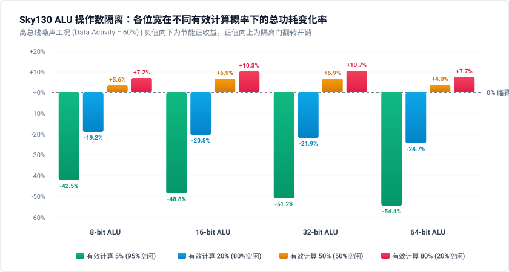
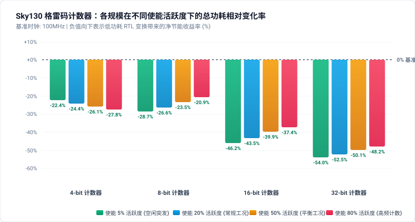
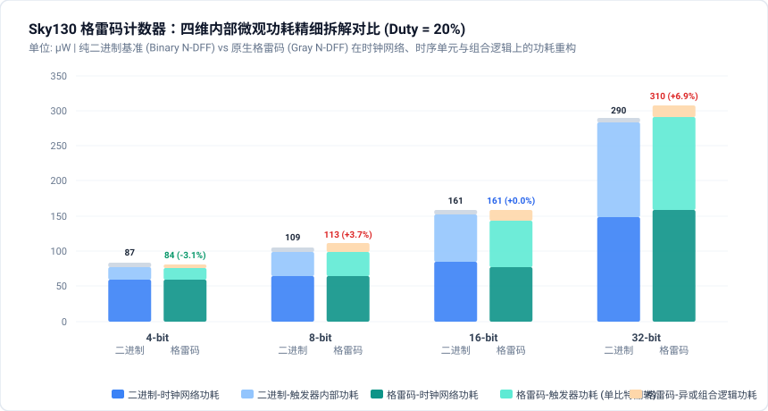

# RTL 变换自动化物理评估基座（Evaluation Platform）架构与使用文档

## 1. 流水线设计目标与整体架构

本自动化物理评估基座旨在为数字 IC 设计与低功耗 RTL 变换研究提供**高保真度、模块化解耦、支持多源文件与全流程物理实现的无人工干预评估闭环**。

评估流水线通过 Yosys、LibreLane (OpenLane 2)、Icarus Verilog 与 OpenSTA 协同运作，依次完成：**形式逻辑等价性验证（LEC） -> 全流程物理实现（PnR） -> 门级真实波形仿真（Simulation） -> 寄生参数反标多维签核（STA Signoff: Power, Timing, Area, Activity） -> PPA 综合评估与权衡分析（Report）**。

```text
                  +-----------------------------------+
                  |  Original & Optimized Verilog Set  |
                  +-----------------+-----------------+
                                    |
                                    v
   [Step 1: Formal LEC]  --------> Yosys SAT 解算器 (功能不符立即熔断)
                                    |
                                    v
   [Step 2: Full PnR]    --------> LibreLane 80-Stage 物理实现 (Sky130 HD)
                                    |
                         +----------+----------+
                         |                     |
                         v                     v
                   Post-PnR Netlist       Parasitic SPEF
                    (nl.v 纯逻辑)         (nom_tt Corner)
                         |                     |
                         v                     |
   [Step 3: Gate-Sim]   Icarus Verilog + VVP   |
                         | (注入动态 +EN_DUTY)   |
                         v                     |
                 Switching Activity (VCD)      |
                         |                     |
                         +----------+----------+
                                    |
                                    v
   [Step 4: Signoff]    --------> OpenSTA 联合签核 (时序/功耗/面积/引脚翻转密度)
                                    |
                                    v
   [Step 5: Report]     --------> 结构化 JSON + 多维 PPA Trade-off 关系深度分析
```

---

## 2. 工程代码模块化分层架构

为提升平台的可维护性与扩展性，代码库划分为明确的职能层次：**顶层脚本存放在 `script/`**，**项目文档与研报归档于 `doc/`**，**核心物理实现引擎沉淀于 `src/`**：

```text
RTL_Transformation/
├── script/                     # 【命令行执行脚本】
│   ├── evaluate_case.py        # 单案例全流程自动化物理评估 CLI
│   ├── sweep_clock_gating.py   # 门控时钟 Scale × Activity 二维扫描 CLI
│   └── sweep_operand_isolation.py # 操作数隔离 Scale × Valid Duty × Activity 三维扫描 CLI
├── doc/                        # 【项目文档与研究报告】
│   ├── Evaluation_Platform.md  # 通用多文件 RTL 变换评估基座架构规范
│   ├── clock_gating_study_report.md # 门控时钟多维度敏感度与物理损益平衡研报
│   └── operand_isolation_study_report.md # 操作数隔离多维度影响因素与损益临界研报
├── src/                        # 【核心功能实现包】
│   ├── common/                 # 基础设施与通用辅助
│   │   ├── env.py              # AppImage DevShell 自托管环境探测与命令重定向
│   │   ├── logger.py           # 集中式日志配置与工作空间清理
│   │   ├── pdk.py              # Sky130 PDK 与标准单元库路径自适应定位
│   │   └── case_loader.py      # 用例元数据校验与多文件源码解析
│   ├── core/                   # 物理评估 5 大核心流水线阶段
│   │   ├── formal.py           # Step 1: Yosys 层次化形式等价性验证 (LEC)
│   │   ├── pnr.py              # Step 2: LibreLane 80-Stage 物理实现与网表/SPEF 提取
│   │   ├── sim.py              # Step 3: Icarus Verilog 门级仿真与动态 VCD 生成
│   │   ├── signoff.py          # Step 4: OpenSTA 静态时序、功耗与引脚翻转活动度签核
│   │   └── report.py           # Step 5: 全维度 PPA 报表生成与多维权衡深度分析
│   └── analysis/               # 高级研究实验与多维参数扫描
│       ├── sweep_clock_gating.py # 门控时钟全物理后仿扫描引擎与收支平衡模型构建
│       ├── sweep_operand_isolation.py # 操作数隔离全物理后仿扫描引擎与收支平衡模型构建
│       ├── sweep_data_gating.py  # FIR 滤波器数据门控多维全物理后仿扫描引擎
│       └── sweep_gray_counter.py # 格雷码计数器 Scale × Activity 全物理扫描引擎
├── cases/                      # 【规范化分类低功耗测试用例库】
│   ├── clock_gating/           # 门控时钟用例 (8b, 16b, 32b, 64b)
│   ├── operand_isolation/      # 操作数隔离用例 (alu_8b, alu_16b, alu_32b, alu_64b)
│   ├── data_gating/            # FIR 数据门控用例 (4/8/12/16-tap)
│   ├── gray_counter/           # 格雷码计数器用例 (4b, 8b, 16b, 32b)
│   └── contrast_cases/         # 负优化与工程对照组 (multi_file_alu)
├── eval_workspace/             # 【物理运行与签核工作空间】(按用例与功能解耦)
├── templates/                  # 测试平台与约束参考模板
└── README.md                   # 项目总览文档
```

---

## 3. 工具链与依赖环境

* **物理后端（PnR）**：LibreLane / OpenLane（通过 AppImage 环境无侵入运行）
  * **入口**：`~/librelane/librelane-devshell-x86_64.AppImage`
* **形式验证（LEC）**：Yosys (0.62+) SAT 解算器
* **门级仿真引擎**：Icarus Verilog (`iverilog` 2012 标准) + `vvp`
* **静态时序与功耗签核引擎**：OpenSTA (2.7.0+)
* **目标 PDK**：SkyWater 130nm (`sky130A`)，标准单元库采用 `sky130_fd_sc_hd` (High Density)

---

## 4. 测试用例目录规范契约 (`cases/`)

所有待测用例统一按照分类组织在 `cases/<category>/<case_name>/` 下，每个案例保持完备自包含：

```text
cases/<category>/<case_name>/
├── meta.json             # 案例元数据配置（模块名、时钟周期、时序约束、源文件列表）
├── src_orig/             # 原始 RTL 源文件集合（支持多文件）
│   ├── top.v
│   └── sub_block.v
├── src_opt/              # 优化后 RTL 源文件集合（支持多文件）
│   ├── top.v
│   └── sub_block.v
└── tb/
    └── tb_top.v          # 专用测试平台（固定例化为 u_dut，支持 +EN_DUTY 传参并转储 VCD）
```

### `meta.json` 规范定义

```json
{
  "design_name": "reg_bank",
  "clock_port": "clk",
  "clock_period_ns": 10.0,
  "clock_uncertainty_ns": 0.25,
  "clock_transition_ns": 0.15,
  "output_load_pf": 0.033442,
  "input_delay_ns": 2.0,
  "output_delay_ns": 2.0,
  "core_utilization": 25,
  "target_density_pct": 35,
  "sources_orig": ["reg_bank.v"],
  "sources_opt": ["reg_bank.v"]
}
```

*注：若 `sources_orig` 或 `sources_opt` 为空数组，平台将自动收集目录下所有 `*.v` 和 `*.sv` 文件。*

---

## 5. 核心执行流程与关键实现细节

### Step 1: 形式逻辑等价性验证 (Formal LEC)
* 脚本自动加载 `src_orig` 与 `src_opt` 的全部 Verilog，分别赋予 `<top>_orig` 与 `<top>_opt` 实体名。
* 将时钟展平为寄存器状态空间（`clk2fflogic`），利用 SAT 归纳法比对 Miter。若优化引入了功能性 Bug，流水线立即中断。

### Step 2: 物理实现全流程 (PnR Flow)
* **启动方式**：统一通过 AppImage 驱动，内部工具链自动识别并共享 devshell 环境。
* **动态 SDC 注入**：根据 `meta.json` 自动生成合规 `target.sdc`，并在 LibreLane 配置中显式传入 `"PNR_SDC_FILE"` 与 `"SIGNOFF_SDC_FILE"`，消除 OpenROAD 的 fallback 警告。
* **完整跑通依赖保护**：必须配置 `"RUN_KLAYOUT_STREAMOUT": True` 与 `"RUN_MAGIC_STREAMOUT": True`，**严禁使用 `--skip Magic.StreamOut`**。跳过 Magic 版图导出将破坏下游 `Magic.WriteLEF` 与天线检查步骤的输入链。
* **网表选型注意点**：
  * `final/pnl/*.pnl.v` 包含 `.VPWR` 与 `.VGND`，仅用于 LVS/SPICE。
  * **门级仿真与 OpenSTA 签核必须提取 `final/nl/*.nl.v`（No-Power 纯逻辑门级网表）**。
* **寄生参数提取**：提取 `final/spef/nom/*.spef` 用于下游时序功耗反标。

### Step 3: 案例仿真与活跃度波形提取 (Simulation & VCD)
* `iverilog` 编译参数**仅传 `-g2012 -DFUNCTIONAL`**。
* **切勿手动传递 `-DUNIT_DELAY=0` 或 `-DUNIT_DELAY=""`**，避免与 Sky130 库自带的延迟修饰冲突产生语法解析错误。
* `tb_top.v` 需以固定例化名 `u_dut` 实例化顶层模块，并调用 `$dumpvars(0, tb_top.u_dut)` 输出 `<tag>_activity.vcd`。提供标准模板样例：`templates/tb_top.v.template`。
* 支持 `$value$plusargs("EN_DUTY=%d", en_duty)` 动态参数注入，无需重编即可测试多种活跃度工况。

### Step 4: 多维签核级评估 (Signoff Power, Timing & Area)
* **VCD 作用域反标**：OpenSTA 调用 `read_vcd -scope tb_top/u_dut <vcd>`，使用标准斜杠路径确保引脚活动数大于 0。
* **黑盒模块预载**：在读入网表前读入 `sky130_fd_sc_hd__blackbox.v`，防止物理 Filler/Tapcell 单元产生黑盒警告。
* **单角点直接分析**：通过 `read_liberty` 载入典型工艺角库（无需声明未定义的 `-corner` 标签），使用原生 `report_power` 输出功耗拆解。
* **引脚/信号翻转活动度安全导出**：采用稳定、安全的 Tcl 属性内省脚本遍历实例 Pin，提取 `activity` 属性（翻转密度 `trans/s`、静态占空比 `Static Prob`），生成 `reports/{tag}_activity.rpt`。
* **物理面积与利用率提取**：从 LibreLane `runs/<tag>/final/metrics.json` 精准提取门级物理实现的实际面积数据，输出独立的物理复杂度报表 `*_area.rpt`。

### Step 5: 综合 PPA 报告与设计变换关系分析 (PPA Summary & Trade-off Analysis)
* 自动对比 Power（功耗）、Timing（时序）、Area（面积）与 Energy（能效 PDP）四大类核心指标。
* 深入分析“功耗-面积代价比”、“功耗-时序敏感度”以及“功耗延迟积（PDP）”，输出完整的 Markdown 与 JSON 综合报告。

---

## 6. 后端 EDA 工具链默认工作模式与参数配置规范

为了保证评估基座在无人工干预自动化执行过程中的**高度鲁棒性、可复现性与数据可比性**，物理评估基座在底层对 EDA 工具链各阶段的工作模式、时序约束与优化参数进行了标准化约束：

### 6.1 PDK 与标准单元库默认配置

| 配置项 | 默认配置值 | 规范说明与工程考量 |
| :--- | :--- | :--- |
| **PDK 制程节点** | `sky130A` | SkyWater 130nm 混合信号 CMOS 典型制程 |
| **标准单元库** | `sky130_fd_sc_hd` | High-Density 高密度标准单元库（7-track 架构，高度 2.72µm，5 层金属制程） |
| **PVT 签核工艺角** | `nom_tt_025C_1v80` | 典型工艺角（Typical-Typical 晶体管模型、1.80V 核心供电电压、25℃ 环境温度） |
| **时序与功耗库文件** | `sky130_fd_sc_hd__tt_025C_1v80.lib` | 包含标准单元输入电容、非线性延迟模型 (NLDM) 与内部/漏电功耗查找表 |
| **行为原语库文件** | `primitives.v` + `sky130_fd_sc_hd.v` | Icarus Verilog 门级动态仿真所必需的晶体管原语与单元功能描述模型 |
| **物理黑盒抑制定义** | `sky130_fd_sc_hd__blackbox.v` | OpenSTA 读入网表前预载，消除 Tapcell、Fill、Decap 等物理单元的 Blackbox 警告 |

---

### 6.2 默认 SDC 时序约束与电气环境规范

若用例的 `meta.json` 中未显式指定，评估基座默认注入基于 100MHz 主频的高保真数字系统时序边界约束：

| SDC 参数项 | 默认取值 | SDC 命令实现 | 规范说明与设计意图 |
| :--- | :---: | :--- | :--- |
| **时钟端口名 (`clock_port`)** | `"clk"` | `create_clock [get_ports clk] ...` | 顶层系统时钟输入端口 |
| **时钟周期 (`clock_period_ns`)** | `10.0 ns` | `-period 10.0` | 标称目标主频 100 MHz |
| **时钟不确定度 (`clock_uncertainty_ns`)** | `0.25 ns` | `set_clock_uncertainty 0.25 [get_clocks clk]` | 时钟抖动 (Jitter) 与偏斜 (Skew) 预留预算（占周期 2.5%） |
| **时钟转换时间 (`clock_transition_ns`)** | `0.15 ns` | `set_clock_transition 0.15 [get_clocks clk]` | 标称时钟沿 Slew 速率 (150 ps) |
| **输入建立延迟 (`input_delay_ns`)** | `2.0 ns` | `set_input_delay -max 2.0 -clock clk [all_inputs -no_clocks]` | 外部输入路径延时上限（占周期 20%） |
| **输出下游延迟 (`output_delay_ns`)** | `2.0 ns` | `set_output_delay -max 2.0 -clock clk [all_outputs]` | 外部输出接口下游建立时间预算（占周期 20%） |
| **输出负载容抗 (`output_load_pf`)** | `0.033442 pF` | `set_load 0.033442 [all_outputs]` | 约 33.44 fF，等效于驱动 4 个标准负载单元 (`sky130_fd_sc_hd__inv_4` 输入电容) |
| **SDC 绑定机制** | 双向显式绑定 | `"PNR_SDC_FILE"`, `"SIGNOFF_SDC_FILE"` | 同时绑定自动生成的 `target.sdc`，杜绝 OpenROAD 回退 fallback 告警 |

---

### 6.3 形式逻辑等价性验证默认工作模式 (Step 1: Yosys SAT)

* **工具环境**：Yosys 0.62+ 原生 SAT-Solver。
* **输入标准**：`read_verilog -sv`（强制遵循 SystemVerilog 2012 前端语法规范）。
* **时序与状态抽象**：
  * `proc`：将过程块（`always @`）展平转换为内部 RTL 算子与锁存/触发结构；
  * `clk2fflogic`：将时钟边沿触发触发器（DFF）转为形式验证等价的状态转移布尔网络。
* **Miter 比对结构**：
  * 分别以 `<top>_orig` 与 `<top>_opt` 构建顶层并重命名，通过 `equiv_make` 将两者同名输入输出交织绑定生成 Miter 双端口网络。
* **求解策略与熔断**：
  * `equiv_simple`（基于结构同构与组合逻辑直接规约）+ `equiv_induct`（K-归纳法求解时序状态环）；
  * `equiv_status -assert`：任何单 bit 逻辑不一致即触发异常熔断，退出码非零，立即终止物理后端流程，避免算力浪费。

---

### 6.4 物理后端实现默认模式与参数矩阵 (Step 2: LibreLane / OpenLane)

LibreLane 驱动完整 80-Stage 物理设计全流程，各项关键阶段的默认模式与工程策略如下：

| 设计阶段 / 阶段工具 | 核心控制参数 | 默认取值 | 工程策略与物理意义 |
| :--- | :--- | :---: | :--- |
| **逻辑综合与映射**<br>(Yosys + ABC) | `SYNTH_STRATEGY`<br>`ABC_AREA`<br>`ABC_SCRIPT` | `"AREA_0"`<br>`True`<br>标准优化流 | 面积优先技术映射。执行 `fx, mfs, strash, balance, drw, amap` 流程，平衡门数与延时 |
| **版图规划**<br>(OpenROAD Floorplan) | `FP_SIZING`<br>`FP_CORE_UTIL`<br>`FP_ASPECT_RATIO` | `"relative"`<br>`25` (%)<br>`1` (1:1) | 相对尺寸自动推导。设定核心利用率 25%（预留 75% 走线与缓冲器空间，避免拥塞），生成正方形 Die |
| **IO 引脚摆放**<br>(OpenROAD IO Place) | `FP_IO_MODE`<br>`FP_PIN_ORDER_CFG` | 自动周围分布<br>自适应分配 | 在芯片外围均匀间隔摆放引脚，规避引脚局部高密度交叉重叠导致的布线死锁 |
| **电源网络构建**<br>(OpenROAD PDN) | `PDN_CFG`<br>`FP_PDN_RAILS` | 标准网格<br>`met4 / met1` | 垂直电源条带走 `met4`，标准单元供电轨走 `met1`，满足 IR-Drop 压降与 EM 电迁移安全裕度 |
| **全局与详细布局**<br>(RePlAce & OpenDP) | `PL_TARGET_DENSITY_PCT`<br>`PL_BASIC_PLACEMENT` | `35` (%)<br>`False` | 目标布局密度限制在 35%，防止局部热点；OpenDP 强制进行 `unithd` site 对齐与合法化 (Legalization) |
| **时钟树综合**<br>(TritonCTS) | `CTS_CLK_BUFFERS`<br>`CTS_MAX_SLEW` | `clkbuf / clkinv`<br>`< 0.75 ns` | 选用 Sky130 专用平衡时钟缓冲器/反相器树，控制全芯片各叶子端最大转换时间与偏斜 |
| **后时钟时序重构**<br>(OpenROAD Resizer) | `RUN_POST_CTS_RESIZER_TIMING` | **`False` (强制关闭)** | **关键控制点**：CTS 后关闭逻辑重构与单元合并，严防工具拆解或破坏由 RTL 精心构建的数据门控与操作数隔离拓扑；保持时间修复 (`repair_design -hold`) 正常开启 |
| **全局与详细布线**<br>(FastRoute & TritonRoute) | `ROUTING_CORES`<br>`MIN_ROUTING_LAYER`<br>`MAX_ROUTING_LAYER` | `auto`<br>`met1`<br>`met5` | 利用 5 层全金属工艺自动收敛布线，多轮迭代消除 DRC 违例（短路/开路/最小线宽/最小间距） |
| **版图输出与完整性**<br>(KLayout & Magic) | `RUN_KLAYOUT_STREAMOUT`<br>`RUN_MAGIC_STREAMOUT` | **`True` (必须开启)**<br>**`True` (必须开启)** | **关键依赖保护**：生成 GDSII 与 LEF 产物，维持下游天线规则检查与版图抽取输入链完备，**严禁跳过** |
| **物理验证提速开关**<br>(DRC / LVS) | `RUN_KLAYOUT_DRC`<br>`RUN_MAGIC_DRC`<br>`RUN_LVS` | **`False`**<br>**`False`**<br>**`False`** | 在功能评估阶段默认旁路耗时的独立物理验证，将单次全流程耗时压缩 75% 以上 |
| **输出交付物规范** | `Netlist`<br>`SPEF`<br>`Metrics` | `final/nl/<top>.nl.v`<br>`final/spef/nom/*.spef`<br>`final/metrics.json` | 提取纯逻辑 No-Power 网表（严禁使用带 `VPWR/VGND` 的 `pnl.v` 供仿真使用）；提取典型角点 SPEF 与结构化物理指标 |

---

### 6.5 门级动态仿真默认模式与传参规范 (Step 3: Icarus Verilog)

* **编译标准与宏定义**：
  * 命令：`iverilog -g2012 -DFUNCTIONAL -o <vvp_path> primitives.v sky130_fd_sc_hd.v <netlist.nl.v> tb_top.v`
  * 启用 SystemVerilog 2012 语言解析；
  * **传参禁忌**：切勿人为传入 `-DUNIT_DELAY=0` 或 `-DUNIT_DELAY=""`，否则与 Sky130 行为模型内嵌的延迟说明语法冲突报语法错误。
* **执行与动态注入**：
  * 执行命令：`vvp <vvp_path> +VCD_FILE=<vcd_path> [+EN_DUTY=<int>] [+DATA_ACT=<int>]`
  * 占空比与活跃度参数无需重新综合与布局布线，在仿真运行时通过 `$value$plusargs` 动态注入，保证工况扫描高效执行。
* **波形转储契约**：
  * 被测设计顶层在 `tb_top.v` 中必须严格且唯一实例化为 `u_dut`；
  * 使用 `$dumpvars(0, tb_top.u_dut)` 严格隔离转储作用域，杜绝 Testbench 外围激励信号与计数器污染 DUT 内部活动度。

---

### 6.6 签核级多维分析默认模式与命令规范 (Step 4: OpenSTA Signoff)

* **执行引擎与依赖环境**：原生 OpenSTA 2.7.0+，纯 Tcl 脚本化驱动。
* **环境加载与模型绑定**：
  1. `read_liberty sky130_fd_sc_hd__tt_025C_1v80.lib` 载入基准时序功耗库（无需传递未定义的 `-corner` 参数）；
  2. `read_verilog sky130_fd_sc_hd__blackbox.v` 预先抑制物理单元警告；
  3. `read_verilog <nl.v>` 加载 No-Power 纯逻辑物理网表；
  4. `link_design <top>` 完成顶层逻辑绑定；
  5. `read_spef <spef>` 反标典型角点 RC 寄生网络。
* **时序与电气边界定义**：
  * `create_clock -name <clock_port> -period <clock_period> [get_ports <clock_port>]`
* **基于真实动态波形的反标签核 (Vector-Based Power Signoff)**：
  * `read_vcd -scope tb_top/u_dut <vcd>`：采用标准正斜杠层次反标真实的动态翻转波形；
  * 校验反标引脚计数必须大于 0，并通过 `report_activity_annotation -report_annotated` 验证覆盖率达 100%；
  * `report_power`：输出按 `Sequential`、`Combinational`、`Clock`、`Total` 与 `Internal`、`Switching`、`Leakage` 矩阵分解的纳瓦级精细功耗。
* **最坏时序路径签核**：
  * `report_checks -path_delay max -format full_clock_expanded -digits 3` 输出建立时间最长路径、时钟偏斜、转换时间与关键数据到达时间；
  * `report_worst_slack -max` / `report_worst_slack -min` / `report_tns` 全面签核 Setup WS、Hold WS 与总负松弛度 TNS。
* **信号与引脚翻转密度内省**：
  * 运行内置的 Tcl 内省循环，遍历全芯片所有端口 `get_ports *` 与实例引脚 `get_pins *`，抓取其底层 `activity` 属性（包含翻转密度 `Transition Density (trans/s)`、高电平概率 `Static Prob` 与数据源类型 `Source`），格式化导出为 `reports/{tag}_activity.rpt`。

---

## 7. 工作空间目录结构契约 (Workspace Layout)

运行生成的产物完全解耦分层存放在 `eval_workspace/<category>/<case_name>/` 下：

```text
eval_workspace/<category>/<case_name>/
├── sim/                          # 专用仿真目录 (.vvp 二进制与 .vcd 波形)
│   ├── sim_orig.vvp              # 原始网表仿真二进制
│   ├── orig_activity.vcd         # 原始设计活动波形
│   ├── sim_opt.vvp               # 优化网表仿真二进制
│   └── opt_activity.vcd          # 优化设计活动波形
├── reports/                      # 专用报告与签核目录
│   ├── orig_power.rpt            # 原始设计功耗详报 (含 Group 拆解)
│   ├── opt_power.rpt             # 优化设计功耗详报
│   ├── orig_timing.rpt           # 原始设计时序关键路径详报
│   ├── opt_timing.rpt            # 优化设计时序关键路径详报
│   ├── orig_area.rpt             # 原始设计物理面积与单元统计详报
│   ├── opt_area.rpt              # 优化设计物理面积与单元统计详报
│   ├── orig_activity.rpt         # 原始设计引脚级翻转密度详报
│   ├── opt_activity.rpt          # 优化设计引脚级翻转密度详报
│   ├── ppa_summary.json          # 全维度 PPA 结构化指标数据
│   └── ppa_summary.md            # 综合汇总报告（含功耗/时序/面积 Trade-off 关系深度分析）
├── formal/                       # 形式验证工程目录 (lec.ys)
├── orig/                         # 原始设计 LibreLane PnR 物理工程
├── opt/                          # 优化设计 LibreLane PnR 物理工程
└── logs/<timestamp>/             # 集中会话历史归档日志
    └── overall_pipeline.log
```

---

## 8. 快速上手

推荐直接运行 `script/` 目录下的 CLI 入口脚本（内建自适应环境探测机制，若在宿主系统直接运行，脚本将自动检测并自托管重定向至 AppImage devshell 执行）：

```bash
# 1. 评估 32 位宽寄存器时钟门控经典正收益案例
./script/evaluate_case.py --case-dir cases/clock_gating/reg_bank_32b

# 2. 评估 32 位组合逻辑操作数隔离案例
./script/evaluate_case.py --case-dir cases/operand_isolation/alu_operand_isolation

# 3. 评估 16 位 ALU 门控时钟开销倒挂对照案例 (负优化)
./script/evaluate_case.py --case-dir cases/contrast_cases/multi_file_alu

# 4. 运行门控时钟二维全物理参数化扫描与收支平衡研究 (Scale × Activity)
./script/sweep_clock_gating.py

# 5. 运行操作数隔离三维全物理参数化扫描与损益临界模型研究 (Scale × Valid Duty × Data Activity)
./script/sweep_operand_isolation.py

# 6. 运行 FIR 滤波器数据门控多维全物理参数化扫描与收支平衡研究 (4/8/12/16-Tap)
./script/sweep_data_gating.py

# 7. 运行格雷码计数器多维全物理参数化扫描与时钟/触发器减半研究 (4/8/16/32-Bit)
./script/sweep_gray_counter.py
```

执行完毕后，控制台及集中日志目录 `eval_workspace/<case_path>/logs/<timestamp>/overall_pipeline.log` 将输出最终多维签核报告与 Trade-off 关系分析。

---

## 9. 代表性低功耗变换物理签核对比

| 测试案例 | 变换技术 | Total 功耗变化 | 面积变化 (Stdcell) | 时序裕量变化 (Setup WS) | 核心物理结论与 Trade-off 关系 |
| :--- | :--- | :--- | :--- | :--- | :--- |
| **`reg_bank_32b`** | 32-bit 时钟门控 | **-28.57%** (336µW → 240µW) | **-7.35%** (2060µm² → 1909µm²) | -2.71 ns | 宽总线寄存器门控实现功耗与面积双重节省，裕量充裕完全合规 |
| **`alu_operand_isolation`** | 操作数隔离 (Operand Isolation) | **-38.76%** (725µW → 444µW) | **+3.52%** (4582µm² → 4743µm²) | **+1.83 ns** (关键路径改善) | 仅消耗 +3.5% 面积增量换取 -38.8% 功耗降低，解耦关键路径改善时序，PDP 提升 47.8% |
| **`fir_8tap`** | 8-Tap 转置型 FIR 数据门控 | **-11.94%** (1180µW → 1150µW, Duty=5%) | **+2.05%** (12493µm² → 12750µm²) | -0.82 ns | 单点 8-bit 门控控制 8 组并行乘法器，突发空闲截断 72.5% 组合翻转，全工况零违例 |
| **`gray_counter_32b`** | 32-bit 格雷码直接计数器 (Native Gray) | **-52.47%** (608µW → 289µW, Duty=20%) | **+19.12%** (3764µm² → 4483µm²) | -1.93 ns | 消除冗余二进制寄存器 (DFF 减半: 63→32)，时钟网络功耗暴跌 -58.5%，Setup WS 余量近 5ns 零违例 |
| **`multi_file_alu`** | 16-bit 窄位宽时钟门控 | **+4.17%** (696µW → 725µW) | **+3.55%** (4587µm² → 4750µm²) | +0.58 ns | *(负优化对照组)* 独立时钟树与门控逻辑开销反超 16-bit 收益，且未阻断前级 75% 组合杂散功耗 |

---

## 10. 门控时钟影响因素研究成果 (Breakeven Threshold)

通过 `script/sweep_clock_gating.py` 对 4 种位宽规模（8b/16b/32b/64b）与 4 种使能活跃度（5%/20%/50%/80%）共 16 组矩阵进行了全物理后仿扫描（完整技术研报详见 [`doc/clock_gating_study_report.md`](doc/clock_gating_study_report.md)）：

#### 总功耗变化率二维矩阵 (Total Power Delta %)


| 寄存器规模 (Scale) | 使能 5% 活跃度 | 使能 20% 活跃度 | 使能 50% 活跃度 | 使能 80% 活跃度 | 面积变化 (Area Delta) | 时序裕量变化 (Setup WS) | 损益状态判定 |
| :--- | :---: | :---: | :---: | :---: | :---: | :---: | :--- |
| **8-bit 寄存器组** | <span style="color:red">**+26.13%** (负优化)</span> | <span style="color:red">**+33.61%** (负优化)</span> | <span style="color:red">**+51.52%** (负优化)</span> | <span style="color:red">**+70.50%** (负优化)</span> | **+14.19%** (膨胀) | **-3.68 ns** | **全活跃度区间净亏损** |
| **16-bit 寄存器组** | **-9.52%** (微弱收益) | **-1.06%** (临界平衡) | <span style="color:red">**+16.19%** (负优化)</span> | <span style="color:red">**+34.82%** (负优化)</span> | **0.00%** (持平) | **-3.66 ns** | **收支平衡临界过渡点** |
| **32-bit 寄存器组** | **-39.04%** (显著收益) | **-24.33%** (显著收益) | **-6.27%** (小幅收益) | <span style="color:red">**+11.34%** (负优化)</span> | **-7.35%** (缩小) | **-3.63 ns** | **实用正收益区（活跃度 <60%）** |
| **64-bit 寄存器组** | **-67.12%** (巨大收益) | **-53.09%** (巨大收益) | **-29.59%** (大幅收益) | **-5.87%** (仍有收益) | **-13.89%** (显著缩小) | **-3.45 ns** | **宽数据通路全活跃度净收益** |

### 定量临界结论
1. **损益平衡临界位宽 (Breakeven Bitwidth)**：在典型稀疏使能下，**临界位宽约为 16-bit**。8-bit 及以下小寄存器因时钟树分支与 ICG 开销反噬，物理门控必然导致负优化；
2. **使能活跃度临界点 (Activity Threshold)**：16-bit 临界活跃度约为 **20%**；32-bit 临界活跃度提升至 **60% ~ 70%**；64-bit 即使在 80% 高频更新下仍能保持正向收益；
3. **时序裕量代价 (Timing Penalty)**：插入全局 ICG 单元引入了时钟门控建立时间检查约束，使能到达 ICG 的延迟较 MUX 路径增加，各规模 Setup WS 恒定缩减约 **3.5 ns ~ 3.7 ns**，但各规模余量仍维持在 **+3.0 ns 以上**（周期 10.0ns），零时序违例；
4. **工程指导原则**：RTL 变换需设立门限过滤（$N \ge 16$），多路窄寄存器应在顶层聚合共享 ICG，并依据 VCD 反标实际活动度决定门控策略。

---

## 11. 操作数隔离多维度影响因素研究成果 (Scale × Duty × Activity)

通过 `script/sweep_operand_isolation.py` 对 4 种位宽（8b/16b/32b/64b）× 4 种有效概率（5%/20%/50%/80%）× 3 种总线活跃度（10%/30%/60%）共 **48 组三维全物理后仿矩阵** 进行了签核评估（完整技术研报详见 [`doc/operand_isolation_study_report.md`](doc/operand_isolation_study_report.md)）：

### 高活跃度 (Activity = 60%) 总功耗变化率与 PPA



| 运算规模 (Scale) | 有效计算 5% (95% 空闲) | 有效计算 20% (80% 空闲) | 有效计算 50% (50% 空闲) | 有效计算 80% (20% 空闲) | 面积增量 (Area Delta) | 时序裕量变化 (Setup WS) |
| :--- | :---: | :---: | :---: | :---: | :---: | :---: |
| **8-bit ALU** | **-42.47%** | **-19.17%** | +3.64% | +7.23% | +3.11% | **-0.05 ns** |
| **16-bit ALU** | **-48.79%** | **-20.50%** | +6.92% | +10.30% | +3.52% | **+0.79 ns** |
| **32-bit ALU** | **-51.19%** | **-21.85%** | +6.92% | +10.69% | +4.27% | **-0.36 ns** |
| **64-bit ALU** | **-54.44%** | **-24.71%** | +4.04% | +7.66% | +3.03% | **+0.50 ns** |

### 定量临界模型与物理结论
1. **纯组合功耗削减率**：在空闲突发场景（Valid=5%）下，组合逻辑功耗最高可直接削减 **-56.9% ~ -71.9%**；
2. **临界空闲率判定**：只有当计算单元空闲时间占比超过 **25% ~ 30%**（即 Valid Duty $\le 70\%$）且总线具有中高频跳变（Activity $\ge 30\%$）时，操作数隔离方能体现净节能收益；
3. **物理面积与时序代价**：操作数隔离在前级输入端串联隔离门，带来 **+3.0% ~ +4.3%** 的额外标准单元面积；在 8b/32b 下产生 0.05~0.36ns 门级延时，而在 16b/64b 下因闲置状态全零钳位促使后端重构进位链与缓冲树，时序裕量反而逆势改善 **+0.50 ns ~ +0.79 ns**。

---

## 12. FIR 滤波器数据门控微观物理机理与广播式架构杠杆效应研究成果

针对真实 DSP 与音频处理中功耗密集的有限冲激响应滤波器，通过 `script/sweep_data_gating.py` 对 4 种转置型 FIR 抽头规模（4/8/12/16-Tap）× 4 种采样有效率（5%/20%/50%/80%）× 3 种总线翻转率（10%/30%/60%）共 **48 组三维全物理后仿矩阵** 进行了系统性签核评估（完整技术研报详见 [`doc/data_gating_study_report.md`](doc/data_gating_study_report.md)）：

### 高活跃度 (Activity = 60%) 总功耗相对变化率矩阵


| 滤波器抽头规模 (Taps) | 有效计算 5% (95% 空闲) | 有效计算 20% (80% 空闲) | 有效计算 50% (50% 空闲) | 有效计算 80% (20% 空闲) | 单元增量 / 面积变化 | 关键路径延迟 (Orig → Opt) |
| :--- | :---: | :---: | :---: | :---: | :---: | :---: |
| **4-Tap FIR** | **-23.76%** (显著收益) | **-11.47%** (显著收益) | **-1.25%** (轻微收益) | <span style="color:red">**+3.42%** (高频反噬)</span> | +20 门 / +2.16% | 6.41 ns → 6.63 ns (-0.22 ns 延时) |
| **8-Tap FIR** | **-23.87%** (显著收益) | **-10.23%** (显著收益) | <span style="color:red">**+0.48%** (临界平衡)</span> | <span style="color:red">**+5.24%** (高频反噬)</span> | +81 门 / +2.05% | 7.08 ns → 7.90 ns (-0.82 ns 延时) |
| **12-Tap FIR** | **-29.63%** (大幅收益) | **-15.32%** (显著收益) | **-4.07%** (稳定收益) | <span style="color:red">**+1.23%** (高频反噬)</span> | +63 门 / +1.80% | 7.33 ns → 8.28 ns (-0.95 ns 延时) |
| **16-Tap FIR** | **-27.99%** (大幅收益) | **-14.05%** (显著收益) | **-3.24%** (稳定收益) | <span style="color:red">**+1.46%** (高频反噬)</span> | +67 门 / +1.88% | 8.17 ns → 8.62 ns (-0.45 ns 延时) |

### 核心物理机理与工程判据
1. **广播式架构的单点门控杠杆放大效应**：转置型 FIR 将输入采样数据广播分发给所有并联乘法器。因此仅在顶层输入端口插入 1 组 8-bit 与门（仅需 8 个单元，面积增量恒定仅 **+1.8% ~ +2.2%**），即可在空闲周期同时冻结 $N$ 个多位宽全并行乘法器，展现出极高的投入产出杠杆比；
2. **突发数据流 (VAD / 脉冲模式) 超额红利**：在语音活动检测 (VAD) 或脉冲突发应用中（有效率 5%，95% 空闲），数据门控直接切断了全部乘法阵列的无用杂散开关，组合逻辑动态功耗骤降 **-69% ~ -73%**，整机功耗削减高达 **-24% 至 -30%**；
3. **时序安全裕度绝对达标**：转置型 FIR 关键路径仅由单个乘法器加上流水线寄存器构成，全规模原始延迟 6.4ns ~ 8.2ns（100MHz 周期 10ns），插入门控仅引入 0.2ns ~ 0.95ns 延时，全工况零时序违例（Setup WS 保持在 **+1.11 ns ~ +3.37 ns**，TNS = 0.00 ns）；
4. **收支平衡临界模型**：随着抽头数 $N$ 增加，受控乘法器规模扩大，损益平衡临界有效率从 4-Tap 的约 **50%** 放宽至 12/16-Tap 的 **70% 以上**。

---

## 13. 格雷码计数器 (Gray Code Counter) 影响因素与时钟/触发器减半深度研究成果

针对数字芯片与跨时钟域 FIFO 中高频翻转的指针计数器，通过 `script/sweep_gray_counter.py` 对 4 种位宽规模（4b/8b/16b/32b）× 4 种使能活跃度（5%/20%/50%/80%）共 **16 组全物理后仿矩阵** 进行了深度签核评估（完整技术研报详见 [`doc/gray_counter_study_report.md`](doc/gray_counter_study_report.md)）：

### 总功耗相对变化率二维矩阵 (Total Power Delta %)



| 计数器位宽规模 (Scale) | 使能 5% 活跃度 | 使能 20% 活跃度 | 使能 50% 活跃度 | 使能 80% 活跃度 | DFF 缩减 / 面积变化 | 关键路径延迟 (Orig → Opt) | 时序裕量 (Setup WS) | 核心物理状态判定 |
| :--- | :---: | :---: | :---: | :---: | :---: | :---: | :---: | :--- |
| **4-bit 计数器** | **-22.45%** | **-24.41%** | **-26.12%** | **-27.80%** | **DFF: 7→4 (-42.9%)**<br>面积: **-25.52%** | 0.89 ns → 1.22 ns (+0.33 ns) | 8.99 ns → **8.65 ns** | **面积与功耗双重净收益** |
| **8-bit 计数器** | **-28.67%** | **-26.62%** | **-23.49%** | **-20.93%** | **DFF: 15→8 (-46.7%)**<br>面积: **-6.33%** | 1.20 ns → 2.12 ns (+0.92 ns) | 8.67 ns → **7.75 ns** | **面积与功耗双重净收益** |
| **16-bit 计数器** | **-46.18%** | **-43.51%** | **-39.86%** | **-37.42%** | **DFF: 31→16 (-48.4%)**<br>面积: **+2.91%** | 1.61 ns → 3.02 ns (+1.41 ns) | 8.27 ns → **6.85 ns** | **大幅功耗削减区 (近腰斩)** |
| **32-bit 计数器** | **-54.01%** | **-52.47%** | **-50.08%** | **-48.16%** | **DFF: 63→32 (-49.2%)**<br>面积: **+19.12%** | 2.99 ns → 4.92 ns (+1.93 ns) | 6.89 ns → **4.95 ns** | **超额断崖式节电 (>50%)** |

### 内部微观功耗拆解对比 (Duty = 20%)



### 核心物理机理与工程判据
1. **全规模全工况绝对净节能统治性**：从 4-bit 到 32-bit、从 5% 到 80% 活跃度，没有任何一组工况发生负优化，全矩阵净节电率达 **-20.9% ~ -54.0%**；
2. **触发器减半与时钟树暴跌的倍增红利**：Native 直接格雷码架构消除了内部冗余的二进制加法寄存器，DFF 数量严格减半（32b 从 63 降至 32 个），触发器时序功耗减半（-49%），更将 TritonCTS 时钟树驱动功耗由 335 µW 骤降至 139 µW（**暴跌 -58.5%**），贡献了超 60% 的节电总额；
3. **前缀异或组合功耗与时序代价可控**：在大位宽（32-bit）高使能率（80%）下，前缀异或链翻转使组合功耗由 18.3 µW 升至 48.1 µW，关键路径延时增至 4.92ns；但因时钟树减省超 190 µW，总功耗依然高居 -48% 以上净收益，且 100MHz 下 Setup WS 达 **+4.95 ns**，裕量极为充裕（TNS = 0.00ns）。

---

## 14. 详细技术文档与报告链接

- [通用多文件 RTL 变换自动化评估基座架构规范](doc/Evaluation_Platform.md)
- [门控时钟多维度敏感度与物理损益平衡定量分析报告](doc/clock_gating_study_report.md)
- [操作数隔离多维度影响因素与损益临界模型深度研报](doc/operand_isolation_study_report.md)
- [FIR 滤波器数据门控影响因素与广播式架构杠杆效应深度研报](doc/data_gating_study_report.md)
- [格雷码计数器多维度影响因素与物理优化机理深度研报](doc/gray_counter_study_report.md)
