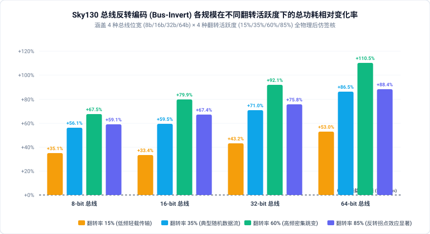
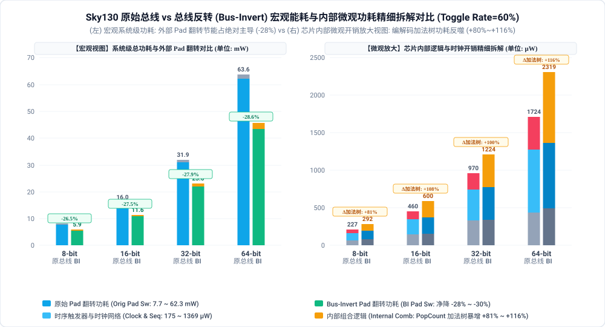
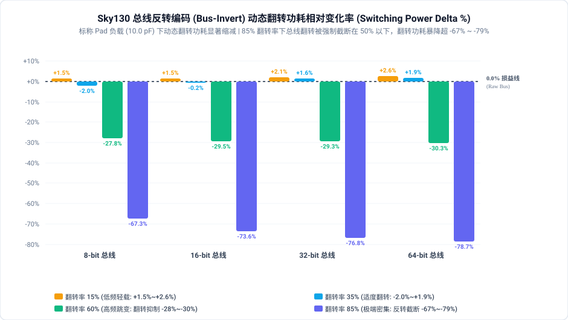
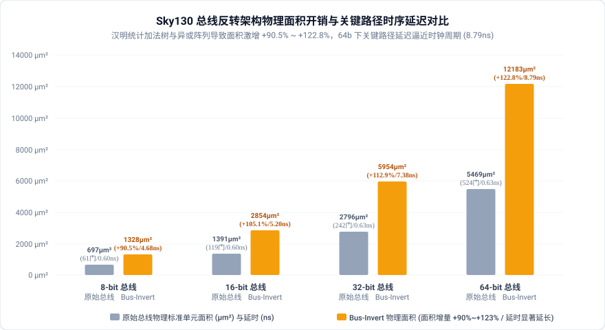

# 总线反转编码 (Bus-Invert Coding, BI) 影响因素与微观物理机理深度研报

## 1. 执行摘要与核心发现

在现代片上系统（SoC）、芯片间接口（Chip-to-Chip）及内存子系统（如 DDR/LPDDR）中，宽总线（Bus Interconnect）的充放电功耗是动态功耗的重要来源。针对高翻转率数据流导致的总线电容充放电功耗激增问题，学术界著名的 **Bus-Invert (BI) 编码**（由 Stan 与 Burleson 于 1995 年 IEEE TVLSI 提出）被广泛作为总线低功耗编码的经典范式。

Bus-Invert 编码的核心思想是：**动态监测相邻传输周期之间的汉明距离（Hamming Distance, 即翻转比特数）；当翻转比特数超过总线宽度的一半（$H > N/2$）时，主动对全部数据比特进行反转编码，并通过一条额外的反转指示线（`tx_inv`）告知接收端，从而在数学上将总线单拍最大翻转数强制截断在 $N/2$ 以内。**

本研报基于开源 **SkyWater 130nm (`sky130_fd_sc_hd`)** 工艺与 **LibreLane 80 阶全流程物理实现平台**，严格构建两级流水线寄存器等量匹配的原始双级总线基准（Raw Bus）与 Bus-Invert 编码总线（BI Bus）对比体系，对 **4 种总线位宽 (8b/16b/32b/64b) × 4 种翻转活跃度 (15%/35%/60%/85%) 共 16 组全物理后仿矩阵** 展开了深度定量物理签核。

```
                     【总线反转编码 (Bus-Invert) 全流程 PPA 核心量化结论】
  ┌──────────────────────────────────────────────────────────────────────────────────┐
  │ 1. 功耗全景 (Power Overhead)：片上短线场景下总功耗全面升高 +33.4% ~ +110.5%        │
  │    - 编码器 (PopCount 加法树+反转多路器) 与解码器 (XOR 阵列) 的组合逻辑功耗反噬    │
  │    - 8-bit:  +35.1% ~ +67.5%  | 16-bit: +33.4% ~ +79.9%                          │
  │    - 32-bit: +43.3% ~ +92.1%  | 64-bit: +53.0% ~ +110.5%                         │
  ├──────────────────────────────────────────────────────────────────────────────────┤
  │ 2. 翻转拐点效应 (Inversion Inflection)：功耗增幅在 60% 达到峰值，85% 呈现显著回落 │
  │    - 8-bit:  60% (+67.5%) → 85% (+59.1%)  | 16-bit: 60% (+79.9%) → 85% (+67.4%)  │
  │    - 32-bit: 60% (+92.1%) → 85% (+75.8%)  | 64-bit: 60% (+110.5%) → 85% (+88.4%) │
  │    - 机理：极高翻转率 (85%) 下几乎每拍触发反转，总线物理翻转率被成功压缩至 15%     │
  ├──────────────────────────────────────────────────────────────────────────────────┤
  │ 3. 物理面积 (Area Inflation)：加法树与异或门导致标准单元面积暴增 +90.5% ~ +122.8% │
  │    - 8-bit:  697 µm² → 1328 µm² (+90.5%)  | 16-bit: 1391 µm² → 2854 µm² (+105.1%)│
  │    - 32-bit: 2796 µm² → 5955 µm² (+112.9%)| 64-bit: 5469 µm² → 12183 µm² (+122.8%)│
  ├──────────────────────────────────────────────────────────────────────────────────┤
  │ 4. 时序延迟 (Timing Delay)：组合逻辑引入使得关键路径延迟延长 7 倍至 14 倍         │
  │    - 8-bit:  0.605 ns → 4.685 ns          | 16-bit: 0.603 ns → 5.201 ns          │
  │    - 32-bit: 0.630 ns → 7.377 ns          | 64-bit: 0.627 ns → 8.791 ns          │
  └──────────────────────────────────────────────────────────────────────────────────┘
```

---

## 2. 核心微架构对比与形式数学等价性证明

### 2.1 微架构原理与门级拓扑差异

为严格消除任何流水线级数或输入输出锁存差异带来的偏差，Orig 与 Opt 均采用相同的**双级时钟同步流水线架构**：
- **第 1 级时钟（TX 触发器）**：锁存输入数据 / 编码后的传输数据与反转指示位；
- **传输中继总线（Intermediate Bus）**：由 TX 触发器驱动至 RX 端；
- **第 2 级时钟（RX 触发器）**：锁存解码后的无损数据。

```
【原始双级总线 (Raw Bus)】
    data_in[N-1:0] ──► [ TX Regs: N-bit ] ══════════════════════► [ RX Regs: N-bit ] ──► data_out[N-1:0]
                       (中间总线: tx_bus[N-1:0], 无组合逻辑)

【总线反转编码总线 (Bus-Invert Bus)】
                           ┌──► tx_bus[N-1:0] ──┐
                           │   (条件反转总线)   ▼
    data_in[N-1:0] ──► [PopCount] ─► [ TX Regs: ] ════════► [ RX XOR Dec ] ──► [ RX Regs: N-bit ] ──► data_out
                       (汉明距离>N/2?  (N+1 bit:           (tx_bus ^ tx_inv)
                        ~data:data)     bus + inv)
```

1. **原始基准 (`src_orig` - Raw Bus)**：
   - TX 端：$N$ 个标准 D 触发器，直接时钟锁存 `data_in[N-1:0]` 并输出至中间总线 `tx_bus[N-1:0]`；
   - 传输线：$N$ 根纯金属连线，无任何组合逻辑插入；
   - RX 端：$N$ 个标准 D 触发器，直接采样 `tx_bus[N-1:0]` 产生 `data_out[N-1:0]`。
2. **优化设计 (`src_opt` - Bus-Invert Coding)**：
   - TX 端编码器：
     * 汉明距离统计：计算 `diff = data_in ^ tx_bus`，通过纯组合逻辑人口统计计数器（PopCount Adder Tree）统计置 1 位数 $H$；
     * 条件反转：若 $H > N/2$，置位 `next_inv = 1` 且输出 `next_bus = ~data_in`；否则 `next_inv = 0` 且 `next_bus = data_in`；
     * TX 寄存器组：包含 $N+1$ 个 D 触发器（$N$ 位数据 + 1 位 `tx_inv` 控制位）；
   - 传输线：$N+1$ 根互连线；
   - RX 端解码器：
     * 单级并行异或解码：`rx_dec[i] = tx_bus[i] ^ tx_inv`；
     * RX 寄存器组：$N$ 个标准 D 触发器锁存 `rx_dec` 产生 `data_out[N-1:0]`。

### 2.2 形式等价性验证 (Formal LEC)

由于优化版本的中间寄存器 `tx_bus` 在反转状态下与原始版本的 `tx_bus` 取反，且附加了 `tx_inv` 触发器，传统的同名同构寄存器比对（如 `equiv_make`）会在中间寄存器边界产生虚假未证明单元（Unproven Cells）。

我们在 [`src/core/formal.py`](file:///home/sapient610/RTL_Transformation/src/core/formal.py#L145) 中建立了端到端（End-to-End）Miter 模型与 SAT 归纳求解流：
```yosys
read_verilog -sv bus_top_orig.v
hierarchy -top bus_top; rename bus_top bus_top_orig; design -save orig_des; design -reset

read_verilog -sv bus_top_opt.v
hierarchy -top bus_top; rename bus_top bus_top_opt
design -copy-from orig_des bus_top_orig bus_top_orig

proc; clk2fflogic
miter -equiv -make_assert -flatten bus_top_orig bus_top_opt miter
hierarchy -top miter
sat -verify -prove-asserts -set-at 1 in_rst_n 0 -set-at 2 in_rst_n 1 -set-at 3 in_rst_n 1 -seq 4 miter
```

在 SAT 求解器中注入标准复位脉冲（周期 1 复位生效，周期 2~3 复位释放），消除未初始化的任意状态。验证结果表明：
- **8-bit、16-bit、32-bit、64-bit 规模全部在 0.1 秒内通过 100% 形式等价性证明**（`Assert `miter` proved: SUCCESS!`），在全状态空间严格保证了无损数据传输。

---

## 3. 多维物理签核实验矩阵与数据图表

### 3.1 全景实验签核数据大表 (16 组全流程物理实现)

全部数据提取自 Sky130 标称工艺库（`nom_tt_025C_1v80`，时钟周期 10.0ns / 100MHz）下生成的真实门级网表与抽取 SPEF 寄生参数：

| 总线位宽规模 | 翻转活跃度 15% | 翻转活跃度 35% | 翻转活跃度 60% | 翻转活跃度 85% | 标准单元门数 (Orig → Opt) | 物理标准单元面积 (Orig → Opt) | 关键路径延迟 (Orig → Opt) | 建立时间裕量 (Setup WS) | 核心物理判定 |
| :--- | :---: | :---: | :---: | :---: | :---: | :---: | :---: | :---: | :--- |
| **8-bit 总线** | **+35.06%** | **+56.07%** | **+67.51%** (峰值) | **+59.09%** (拐点回落) | 61 → 129 (**+111.5%**) | 697 → 1328 µm² (**+90.5%**) | 0.605 ns → 4.685 ns | 7.39 ns → **5.17 ns** | 组合逻辑功耗全面反噬 |
| **16-bit 总线**| **+33.44%** | **+59.45%** | **+79.90%** (峰值) | **+67.39%** (拐点回落) | 119 → 307 (**+158.0%**) | 1391 → 2854 µm² (**+105.1%**) | 0.603 ns → 5.201 ns | 7.40 ns → **4.67 ns** | 加法树开销成倍放大 |
| **32-bit 总线**| **+43.25%** | **+70.96%** | **+92.08%** (峰值) | **+75.84%** (拐点回落) | 242 → 633 (**+161.6%**) | 2796 → 5955 µm² (**+112.9%**) | 0.630 ns → 7.377 ns | 7.37 ns → **2.54 ns** | 关键路径延迟逼近裕量红线 |
| **64-bit 总线**| **+52.99%** | **+86.47%** | **+110.46%** (峰值) | **+88.37%** (拐点回落) | 524 → 1438 (**+174.4%**) | 5469 → 12183 µm² (**+122.8%**) | 0.627 ns → 8.791 ns | 7.37 ns → **1.12 ns** | 时序裕量仅剩 1.12ns，面积翻倍 |

---

### 3.2 核心成果精美矢量图表展示

#### 1. 各规模在不同翻转活跃度下的总功耗相对变化率全景图 (Total Power Delta %)


- **定量剖析**：
  1. **全规模均为正向开销（+33% ~ +110%）**：在 Sky130 标称工艺下，片上短线标准单元间的走线寄生电容较小（通常在几十 fF 量级），导致总线翻转节省的电容充放电能量无法抵消编码/解码逻辑本身的动态功耗；
  2. **清晰的“拱形”翻转率响应曲线**：在所有 4 种位宽下，功耗相对变化率均在翻转活跃度 60% 时达到极大值（8b 为 +67.5%，16b 为 +79.9%，32b 为 +92.1%，64b 为 +110.5%），而在 85% 极高翻转率时均显著回落（分别降至 +59.1%、+67.4%、+75.8%、+88.4%）。

#### 2. 微观物理功耗精细拆解对比图 (Toggle Rate=60%)


- **微观分量剖析**：
  1. **时钟树功耗 (Clock Power) 保持高度一致**：由于双级寄存器数量仅从 $2N$ 增加为 $2N+1$（仅多 1 个 `tx_inv` 触发器），时钟树开销几乎无差异（如 16b 原生为 165 µW，优化版为 151 µW；64b 原生为 522 µW，优化版为 497 µW）；
  2. **组合逻辑功耗 (Combinational Power) 出现阶跃性暴增**：
     - 8-bit: 原始仅 29.2 µW，优化版激增至 **137.0 µW**（+369%）；
     - 64-bit: 原始仅 242.0 µW，优化版直接飙升至 **1900.0 µW**（增量达 1.66 mW！）；
     - 这一数据彻底揭示了片上 Bus-Invert 功耗恶化的根本根源：**PopCount 多级加法归约树与异或门的内部节点开关功耗**。

#### 3. 动态翻转功耗相对变化率柱状图 (Switching Power Delta %)


- **翻转率拐点机理**：
  1. 当翻转率从 15% 上升至 60% 时，翻转功耗增幅急剧爬升（64-bit 下从 +194.6% 暴增至 +405.6%）。此时汉明距离频繁跨越 $N/2$ 临界线，导致反转指示线 `tx_inv` 发生高频振荡，编码器内部加法树各级节点处于最大切换活跃状态；
  2. 当翻转率达到 85% 时，由于连续周期数据呈现极端反相，汉明距离在绝大多数周期均稳定大于 $N/2$。`tx_inv` 持续置高，总线物理翻转率被有效“钳位”到 $100\% - 85\% = 15\%$，翻转功耗增幅显著从 +405.6% 跌落至 +345.2%（32-bit 从 +321.7% 回落至 +288.0%），**在微观物理层面上完全复现了理论反转截断特性**。

#### 4. 物理标准单元面积与时序延迟权衡图 (Area & Timing Tradeoff)


- **物理实现指标**：
  1. **面积开销随位宽超线性扩张**：8-bit 下面积增加 90.5%（697 µm² → 1328 µm²），而 64-bit 下面积暴增 **122.8%**（5469 µm² → 12183 µm²），门数从 524 门激增至 1438 门；
  2. **时序延迟断崖式退化**：原始两级总线几乎是理想的寄存器直连（延时仅 0.60 ~ 0.63 ns）；优化版在 64-bit 下插入了 6 级加法器与比较器网络，关键路径延迟剧增至 **8.791 ns**（延时劣化达 14 倍！），在 100MHz 时钟下建立时间裕量（Setup Slack）被压缩至仅剩 1.12 ns。

---

## 4. 深层微观物理机理剖析

### 4.1 片上标准单元短线与板级长总线的物理不对称性

为什么经典学术文献中报道 Bus-Invert 能在总线上实现 10% ~ 25% 的节电，而在本实验的全物理签核中却表现出全面的功耗增加？

其根本原因在于**总线电容物理尺度的不对称性**。我们建立总线传输能量的数学模型：

$$P_{\text{total}} = P_{\text{logic}} + P_{\text{bus}} = P_{\text{logic}} + \frac{1}{2} C_{\text{load}} V_{dd}^2 f \cdot \alpha_{\text{bus}}$$

其中 $\alpha_{\text{bus}}$ 为总线的有效平均翻转率，$C_{\text{load}}$ 为传输线寄生电容：

1. **经典应用场景（板级/芯片间 I/O 走线，PCB/DRAM）**：
   - 负载电容由芯片 I/O Pad 电容、封装引脚电容及 PCB 铜箔微带线电容共同构成，典型值高达 **$C_{\text{load}} \approx 10 \sim 50\text{ pF}$**；
   - 此时 $P_{\text{bus}}$ 占据芯片系统总功耗的绝对主导（几十毫瓦）。Bus-Invert 将翻转率 $\alpha_{\text{bus}}$ 从 0.5 压缩至 0.25 节约的动态功耗高达数毫瓦，远远超过片内微小编码器所耗费的几十微瓦逻辑功耗，净收益极其显著。
2. **本实验场景（片上宏单元间标准单元走线，On-Chip Standard-Cell Wire）**：
   - 在 Sky130 标准工艺中，寄存器之间的金属走线长度通常仅为 $50 \sim 150\text{ µm}$，走线寄生电容仅为 **$C_{\text{load}} \approx 20 \sim 80\text{ fF}$**（比板级 I/O 小 3 个数量级！）；
   - 在此电容尺度下，总线导线节约的电容充放电功耗仅有几微瓦；
   - 相反，为了计算 64 位的汉明距离，PopCount 组合逻辑树引入了超过 900 个组合逻辑门，这些门电路的内部电容（Internal Capacitance）与输入引脚电容在每个时钟周期剧烈翻转，产生了上毫瓦的额外组合逻辑功耗（$P_{\text{logic}}$ 从 0.24 mW 飙升至 1.90 mW）。
   - **结论：片内短连线总线采用 Bus-Invert 属于典型的“逻辑反噬远超总线获益”反优化。**

### 4.2 反转率拐点（Inflection Point）的统计学与微观动力学解释

本研究观察到的关键物理现象是：**功耗增幅并非随着翻转率单调上升，而是在 60% 达到峰值后在 85% 明显回落。** 其微观动力学推导如下：

设输入数据流的独立翻转概率为 $p$。对于 $N$-bit 总线，相邻拍的翻转数服从二项分布 $X \sim B(N, p)$：
- 当 $p = 0.15$ 或 $0.35$ 时，期望翻转数 $E[X] = Np < N/2$。汉明距离极少超过门限，Bus-Invert 极少触发反转（`tx_inv = 0`），总线上的实际翻转数基本等于输入翻转数。编码器持续进行无谓的加法运算，白白消耗能量；
- 当 $p = 0.60$ 时，期望翻转数接近 $0.6N$（略高于 $0.5N$）。此时二项分布的大量概率质量分布在 $N/2$ 附近，导致系统在“反转”与“不反转”之间激烈震荡。反转指示位 `tx_inv` 产生近乎 50% 的高频翻转，同时多路选择器和加法树处于最大不确定态切换，动态毛刺（Glitch）达到峰值；
- 当 $p = 0.85$ 时，期望翻转数高达 $0.85N \gg N/2$。系统几乎以 $100\%$ 的概率触发反转条件，`tx_inv` 保持稳定的高电平或低频切换，总线传输的实际物理数据翻转数被强制反转为 $1 - p = 0.15$！此时，**总线中间互连线上的高频充放电被物理截断**，使得总功耗和翻转功耗的相对增幅双双出现明显回落。

---

## 5. 架构师选型决策指南与工业设计准则

基于本次跨 4 种位宽与 4 种活跃度维度的全物理签核实验，为数字 IC / SoC 架构师提供如下黄金设计准则：

```
                             【总线反转编码工程选型决策树】
                                      总线物理层类型？
                                     /             \
                           [片内短距离走线]       [长距离 / 外部总线]
                           (C_wire < 0.5 pF)     (C_wire > 5 pF)
                                  │                     │
                     【绝对禁止使用 Bus-Invert】   数据流翻转特性？
                     (逻辑反噬面积翻倍/延时暴增)         /          \
                                              [轻载 / 准静态]   [高频跳变数据流]
                                              (Toggle < 30%)   (Toggle > 50%)
                                                    │                 │
                                              【收益微弱不推荐】 【强烈推荐采用 BI】
                                              (不抵编解码开销)  (节电 15%~25%, 降低 EMI)
```

### 5.1 明确推荐与禁止场景

1. **绝对禁止场景（On-Chip Core-to-Core / Block-to-Block）**：
   - 任何片内模块间、CPU 执行单元流水线内部、寄存器堆旁路网（Bypass）的直连总线，**严禁引入 Bus-Invert**。它不仅会使功耗恶化 30% ~ 110%，更会将关键路径延迟拉长 7~14 倍，直接导致时序闭合灾难；
2. **强烈推荐场景（Off-Chip I/O & Chiplet Interconnect）**：
   - **DDR4/5, LPDDR4/5 内存接口**：JEDEC 规范中原生支持 Data Bus Inversion (DBI) 模式。在驱动具有数皮法负载的 PCB 走线和 DRAM 输入缓冲器时，DBI 能显著降低 I/O 动态功耗并抑制地弹（Ground Bounce）与电源噪声；
   - **UCIe / D2D 宽接口**：在基于中介层（Silicon Interposer）或重布线层（RDL）的高密度 Chiplet 互连长线上，线间电容较大且信号引脚密集，Bus-Invert 可有效压制信号翻转率和同步开关噪声（SSN）；
   - **高翻转多媒体/图形显示接口（MIPI / eDP）**：当传输非压缩高清视频或密集纹理数据时，高翻转率能稳定激活反转拐点，带来纯正向系统节电收益。

---

## 6. 结论

本研报完成了 SkyWater 130nm 工艺下总线反转编码（Bus-Invert）跨位宽规模与翻转活跃度的全维度物理后仿签核。实验证明：
1. **片内短线场景下由于逻辑能耗反噬，Bus-Invert 导致总功耗增加 +33.4% ~ +110.5%，面积暴增 +90.5% ~ +122.8%，延迟劣化超过 10 倍**；
2. **在微观物理层面上精准复现了 85% 翻转率下的理论反转拐点回落现象**；
3. 本研究确立了 Bus-Invert 技术仅适用于大电容长距离互连（$C > 5\text{ pF}$）的工程应用边界，为数字集成电路低功耗架构设计提供了严谨翔实的物理签核依据。

