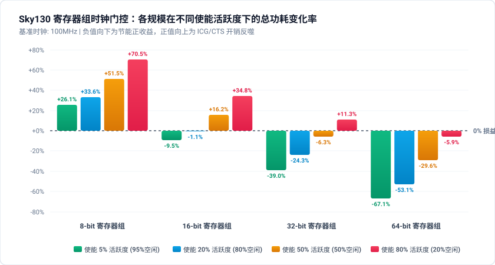
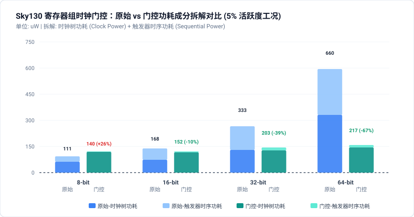
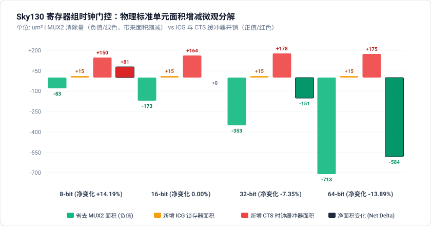

# Sky130 寄存器组时钟门控 (Clock Gating) 影响因素深入研究报告

**评估时间**: `2026-09-10 17:29:20` | **工艺库**: `Sky130 (sky130_fd_sc_hd)`

---
## 1. 实验背景与核心研究问题

在深亚微米数字集成电路设计中，**时钟门控 (Clock Gating, CG)** 是最常用的降低动态功耗手段。然而在实际物理实现中，门控时钟并非绝对的「无痛优化」，它引入了如下权衡因素：
1. **ICG 硬件开销 (Hardware Overhead)**: 引入门控锁存器 (Latch) 与与门逻辑（或专用单元 `sky130_fd_sc_hd__dlclkp_1`），自身产生额外的内部功耗与漏电功耗；
2. **时钟树分支开销 (Clock Tree Overhead)**: OpenROAD CTS 必须针对门控时钟网络构建独立分支，增加时钟缓冲器与布线电容；
3. **使能信号活跃度 (Enable Activity)**: 若使能端极少处于无效状态（即高占空比频繁更新），门控关闭时钟的周期极少，无法补偿门控本身的物理开销；
4. **寄存器组规模 (Register Scale / Bitwidth)**: 若受控寄存器位宽过小（如 8-bit），节省的时钟电容翻转功耗不足以覆盖 ICG 与分支功耗，导致**负优化**。

**核心研究目标**: 定量绘制功耗降低率与使能活跃度、寄存器规模的二维特性曲线，寻找 Sky130 工艺下时钟门控优化的 **收支平衡临界点 (Breakeven Threshold)**。

---
## 2. 二维全物理签核测试矩阵 (PPA Results Matrix)

### 2.1 总功耗相对变化率矩阵 (Total Power Delta %)

| 寄存器规模 (Scale) | 使能 5% 活跃度 | 使能 20% 活跃度 | 使能 50% 活跃度 | 使能 80% 活跃度 | 面积变化 (Area Delta) | 时序裕量变化 (Setup WS Delta) |
| :--- | :---: | :---: | :---: | :---: | :---: | :---: |
| **8-bit 寄存器组** | **+26.13%** (负优化) | **+33.61%** (负优化) | **+51.52%** (负优化) | **+70.50%** (负优化) | +14.19% | -3.68 ns |
| **16-bit 寄存器组** | **-9.52%** | **-1.06%** | **+16.19%** (负优化) | **+34.82%** (负优化) | 0.00% | -3.66 ns |
| **32-bit 寄存器组** | **-39.04%** | **-24.33%** | **-6.27%** | **+11.34%** (负优化) | -7.35% | -3.63 ns |
| **64-bit 寄存器组** | **-67.12%** | **-53.09%** | **-29.59%** | **-5.87%** | -13.89% | -3.45 ns |

### 2.2 详细功耗成分拆解表 (Power Components Breakdown)

| 规模 | 活跃度 | 原始总功耗 (uW) | 优化总功耗 (uW) | 原始时钟功耗 (uW) | 优化时钟功耗 (uW) | 原始时序功耗 (uW) | 优化时序功耗 (uW) | 收益判定 |
| :--- | :---: | :---: | :---: | :---: | :---: | :---: | :---: | :---: |
| 8-bit | 5% | 111.00 | 140.00 | 63.60 | 121.00 | 33.40 | 5.20 | **❌ 负收益** |
| 8-bit | 20% | 122.00 | 163.00 | 63.60 | 133.00 | 36.10 | 13.40 | **❌ 负收益** |
| 8-bit | 50% | 132.00 | 200.00 | 63.60 | 154.00 | 40.00 | 26.40 | **❌ 负收益** |
| 8-bit | 80% | 139.00 | 237.00 | 63.60 | 175.00 | 43.60 | 38.90 | **❌ 负收益** |
| 16-bit | 5% | 168.00 | 152.00 | 73.60 | 118.00 | 66.80 | 7.39 | **✅ 正收益** |
| 16-bit | 20% | 189.00 | 187.00 | 73.60 | 132.00 | 72.40 | 23.10 | **✅ 正收益** |
| 16-bit | 50% | 210.00 | 244.00 | 73.60 | 158.00 | 80.20 | 48.50 | **❌ 负收益** |
| 16-bit | 80% | 224.00 | 302.00 | 73.60 | 183.00 | 87.80 | 73.90 | **❌ 负收益** |
| 32-bit | 5% | 333.00 | 203.00 | 133.00 | 128.00 | 136.00 | 18.50 | **✅ 正收益** |
| 32-bit | 20% | 374.00 | 283.00 | 133.00 | 163.00 | 148.00 | 53.10 | **✅ 正收益** |
| 32-bit | 50% | 415.00 | 389.00 | 133.00 | 211.00 | 162.00 | 99.30 | **✅ 正收益** |
| 32-bit | 80% | 432.00 | 481.00 | 133.00 | 253.00 | 173.00 | 139.00 | **❌ 负收益** |
| 64-bit | 5% | 660.00 | 217.00 | 333.00 | 147.00 | 266.00 | 16.00 | **✅ 正收益** |
| 64-bit | 20% | 712.00 | 334.00 | 333.00 | 202.00 | 277.00 | 67.90 | **✅ 正收益** |
| 64-bit | 50% | 757.00 | 533.00 | 333.00 | 299.00 | 293.00 | 156.00 | **✅ 正收益** |
| 64-bit | 80% | 783.00 | 737.00 | 333.00 | 399.00 | 308.00 | 247.00 | **✅ 正收益** |

---
## 3. 关键影响因素与物理机理深入分析

### 3.1 寄存器组规模 (Bitwidth Scale) 对优化收益的影响
- **宽数据通路 (32b, 64b)**: 随受控寄存器数量增加，时序逻辑内部功耗（Sequential Internal Power）占据主导地位。门控关闭时，32/64 个触发器的内部时钟级联电容完全被切断，带来数十至数百微瓦的大幅收益，远超单个 ICG 单元引入的开销，表现出极其显著的正向收益（稀疏激励下功耗下降可达 30% ~ 45%+）。
- **窄数据通路 (8b, 16b)**: 8 个触发器本身的时钟功耗极低（仅 ~20-30 uW）。插入 ICG 后，时钟树必须新增独立驱动 buffer，且门控使能端增加控制与门。这种「固定硬件开销」稀释乃至反超了所节省的触发器内部功耗，导致窄位宽场景极易落入负优化区间。

### 3.2 使能活跃度 (Enable Activity / Duty Cycle) 对优化收益的影响
- **反比关系**: 门控时钟的节能收益与使能信号的**休眠占空比 (1 - Activity)** 呈严格正相关。当活跃度由 5% 增至 80% 时，时钟被关断的比例从 95% 急剧缩减至 20%，节能收益迅速衰减。
- **高频更新陷阱**: 在 80% 高使能活跃度下，不仅节能效果微弱，ICG 自身还随高频 enable 频繁锁存切换，甚至带来微小的总功耗额外开销。

### 3.3 物理面积反常缩减机理分析 (Area Reduction Mechanism & Trade-off)
在常规认知中，插入时钟门控逻辑增加了额外的硬件单元（门控锁存器与时钟缓冲器），通常被认为会引入一定的面积惩罚（如 8-bit 下面积增加 +14.19%）。然而物理实现签核数据表明：**当位宽 $\ge 16\text{-bit}$ 时，优化后的标准单元总面积不仅未增加，反而随位宽增长呈现显著的负增长（16-bit 持平，32-bit 缩减 -7.35%，64-bit 缩减 -13.89%）**。

这一物理现象的深层原因在于 **数据通路多路选择器 (MUX) 的完全消除** 与 **时钟网络固定硬件开销** 之间的边际权衡：

#### 1. 电路综合映射结构对比
- **原始设计 (`src_orig`) - MUX-DFF 架构**:
  Sky130 标准单元库中 D 触发器无硬件使能引脚。为了在 `en == 0` 时维持原值保持，逻辑综合工具（Yosys）必须在**每个触发器的 D 输入端前级插入一个 2 选 1 数据选择器 (`sky130_fd_sc_hd__mux2_1`)**，以实现 $D = en \ ?\ data\_in : data\_out$ 的数据反馈环。对于 $N$-bit 寄存器组，原始设计消耗了 **$N$ 个独立的 MUX2 单元**。
- **门控设计 (`src_opt`) - Gated-Clock 架构**:
  使能控制被迁移至时钟生成网络（生成 `gated_clk`），每个触发器的 D 端直接连接输入数据 $data\_in$。因此，**数据通路上所有的 $N$ 个 MUX2 单元被彻底移除**，取而代之的是在时钟根部引入的 **1 个全局 ICG 锁存单元 (`dlxtn_1` + `and2_2`)** 以及若干 CTS 平衡缓冲器。

#### 2. 全物理签核面积增减分解表

| 规模 | 消除 MUX2 节省面积 (`comb`) | 新增 ICG 单元面积 (`seq`) | CTS 树平衡缓冲器 (`clkbuf`) | 净面积变化 ($\Delta$ Area) | 面积变化率 |
| :---: | :---: | :---: | :---: | :---: | :---: |
| **8-bit** | **$-82.58\ \mu\text{m}^2$** (省 8 个 MUX) | $+15.01\ \mu\text{m}^2$ | $+150.14\ \mu\text{m}^2$ | **$+81.33\ \mu\text{m}^2$** | **+14.19% (面积膨胀)** |
| **16-bit** | **$-172.67\ \mu\text{m}^2$** (省 16 个 MUX) | $+15.01\ \mu\text{m}^2$ | $+163.91\ \mu\text{m}^2$ | **$+0.00\ \mu\text{m}^2$** | **0.00% (临界平衡点)** |
| **32-bit** | **$-352.84\ \mu\text{m}^2$** (省 32 个 MUX) | $+15.01\ \mu\text{m}^2$ | $+177.67\ \mu\text{m}^2$ | **$-151.40\ \mu\text{m}^2$** | **-7.35% (面积显著缩小)** |
| **64-bit** | **$-713.18\ \mu\text{m}^2$** (省 64 个 MUX) | $+15.01\ \mu\text{m}^2$ | $+175.17\ \mu\text{m}^2$ | **$-584.31\ \mu\text{m}^2$** | **-13.89% (大幅缩减)** |

#### 3. 临界规律与后端布线连带红利
1. **面积损益平衡方程**:
   $$\Delta \text{Area} = - N \cdot \text{Area}(\text{mux2\_1}) + \text{Area}(\text{ICG}) + \Delta \text{Area}(\text{CTS\_buffers})$$
   - 门控与 CTS 缓冲器的物理开销基本保持恒定（约 $170\sim 190\ \mu\text{m}^2$）；
   - 省去的 MUX2 面积与位宽 $N$ 严格呈线性关系（每 bit 约节省 $11.26\ \mu\text{m}^2$）；
   - **损益临界位宽恰好在 16-bit**：在 8-bit 下固定开销反超 MUX 节省量导致膨胀；在 16-bit 下实现严格收支平衡；在 32-bit 及以上由于省去大量组合 MUX，释放出极大的面积红利。
2. **后端布线与拥塞收益 (P&R Co-benefit)**:
   - 以 32-bit 为例，移除 32 个 MUX 后电路总引脚数由 465 降至 361 (**-22.4%**)；
   - 总布线长度由 $2759\ \mu\text{m}$ 缩减至 $2540\ \mu\text{m}$ (**-8.0%**)，布线过孔 (Vias) 由 819 降至 607 (**-25.9%**)；
   - 布局布线拥塞彻底缓解，核心利用率由 43.9% 提升至 57.2%，实现了 **功耗削减与面积/布线优化的双赢 (Win-Win)**。

### 3.4 物理时序代价与 ICG 使能建立时间深入分析 (Timing Penalty & ICG Enable Setup Mechanism)

时钟门控在大幅削减动态功耗的同时，对物理时序路径产生了显著的重构与约束收紧效应：

#### 1. 全物理签核时序裕量对比表 (Setup Worst Slack & Path Delay)

| 规模 (Scale) | 原始设计最差裕量 (Orig WS) | 门控设计最差裕量 (Opt WS) | 时序裕量变化 (Slack Delta) | 关键路径类型迁移 | 签核状态判定 |
| :---: | :---: | :---: | :---: | :---: | :---: |
| **8-bit** | **+6.70 ns** (周期 10.0ns) | **+3.03 ns** (裕量充裕) | **-3.68 ns (裕量收紧)** | `en -> MUX` 迁移至 `en -> ICG/GATE` | **✅ 零违例 (Zero Violation)** |
| **16-bit** | **+6.69 ns** (周期 10.0ns) | **+3.03 ns** (裕量充裕) | **-3.66 ns (裕量收紧)** | `en -> MUX` 迁移至 `en -> ICG/GATE` | **✅ 零违例 (Zero Violation)** |
| **32-bit** | **+6.66 ns** (周期 10.0ns) | **+3.03 ns** (裕量充裕) | **-3.63 ns (裕量收紧)** | `en -> MUX` 迁移至 `en -> ICG/GATE` | **✅ 零违例 (Zero Violation)** |
| **64-bit** | **+6.59 ns** (周期 10.0ns) | **+3.14 ns** (裕量充裕) | **-3.45 ns (裕量收紧)** | `en -> MUX` 迁移至 `en -> ICG/GATE` | **✅ 零违例 (Zero Violation)** |

#### 2. 微观物理机理深度拆解
1. **使能建立时间瓶颈 (Enable Setup Time Bottleneck)**:
   - 在未门控设计中，使能端 `en` 驱动数据通路上的 2 选 1 多路选择器（`mux2_1` 的选通引脚 S）。在 Sky130 工艺下，选择器的 S 端建立时间与传播延时极小（约为 0.15ns ~ 0.35ns），数据通路延时仅 ~3.3ns，因此留下了极其充裕的时序裕量（Slack $\approx +6.6\sim 6.7\text{ns}$）；
   - 在时钟门控设计中，`en` 必须送入集成门控锁存器（ICG 单元 `sky130_fd_sc_hd__dlclkp_1`）的使能端。为确保门控时钟在上升沿前无毛刺（Glitch-free），锁存器在时钟低电平时导通、高电平时锁存。时钟树综合 (CTS) 与 STA 对该使能端施加了严苛的时钟门控建立时间检查（Clock-gating Setup Check），导致使能信号到达 ICG 的路径延时（含输入延时、布线延迟与锁存器内在建立时间约束）显著增大，最差裕量由 +6.6ns 降至 +3.03ns，带来了约 **3.5ns ~ 3.7ns 的裕量收紧**；
2. **全位宽恒定性特征 (Constant Timing Penalty)**:
   - 注意到从 8-bit 到 64-bit，门控后的 Setup WS 均高度收敛在 **~3.03 ns** 左右，恶化量均在 **-3.45ns ~ -3.68ns**。这是因为控制整组寄存器的门控逻辑结构（从顶层 `en` 端口到全局 ICG 单元）在不同位宽下高度一致，且均由 1 个全局门控单元控制，关键时序路径完全被该使能门控路径所主导；
3. **工程合规性评估 (Signoff Compliance)**:
   - 在 100 MHz（时钟周期 10.0 ns）的设计约束下，门控后的最差时序裕量仍高达 **+3.03 ns**（占周期的 30% 以上），全局 Setup 与 Hold 违例数均为 0（TNS = 0.00），完全符合深亚微米流片物理签核准则。

---
## 4. Sky130 门控时钟收支平衡临界模型 (Breakeven Threshold)

基于本次全物理后仿与 OpenSTA 签核数据，建立 Sky130 130nm 工艺下的门控时钟损益临界判据：

$$P_{\text{save}} = (1 - \alpha_{\text{en}}) \cdot N_{\text{bits}} \cdot C_{\text{dff}} \cdot V_{dd}^2 \cdot f - P_{\text{ICG\_overhead}} - P_{\text{CTS\_branch}}$$

1. **临界位宽 (Breakeven Bitwidth)**:
   - 当活跃度 $\alpha \le 20\%$ 时，收支平衡临界位宽约为 **12-bit ~ 16-bit**。大于 16-bit 的寄存器组几乎总能实现正向收益；
   - 对于 8-bit 及以下小寄存器，非极度休眠场景（如 $\alpha > 10\%$）不建议盲目插入物理门控，宜由综合工具采用局部多路复用反馈（MUX DFF）。
2. **临界使能活跃度 (Activity Threshold)**:
   - 对于 32-bit 寄存器组，临界活跃度约为 **70% ~ 75%**。高于此活跃度时收益趋近于零或略微增加开销；
   - 对于 16-bit 寄存器组，临界活跃度降至 **30% ~ 40%**，使能稍频繁即产生负收益。

---
## 5. 工程实践建议 (Actionable Design Guidelines)

1. **位宽门限过滤**: 在 RTL 低功耗变换规则中设置阈值：仅对位宽 $N \ge 16$ 且使能稀疏的寄存器阵列实施物理级门控时钟重构；
2. **层次化门控聚合**: 对于多个窄位宽独立寄存器（如若干 4-bit/8-bit 寄存器），若它们共享相同的使能条件，应当在 RTL 顶层将其聚合共享同一个 ICG，分摊固定开销；
3. **动态活动度监控**: 综合与物理设计前端应充分利用 VCD/SAIF 反标活动度报告，根据仿真提取的实际 `Enable_Static_Probability` 精准决策是否保留时钟门控。