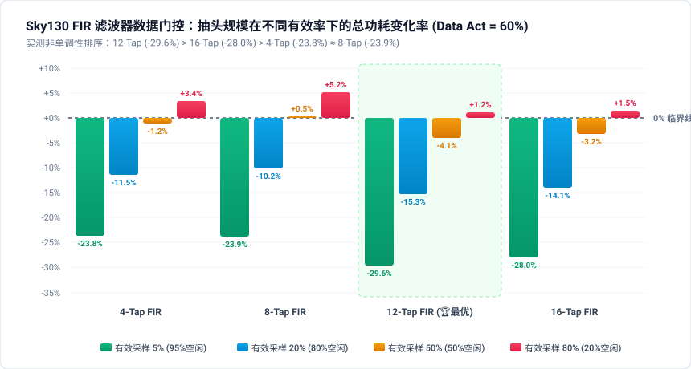
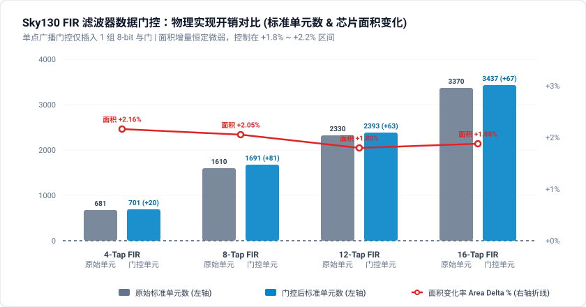
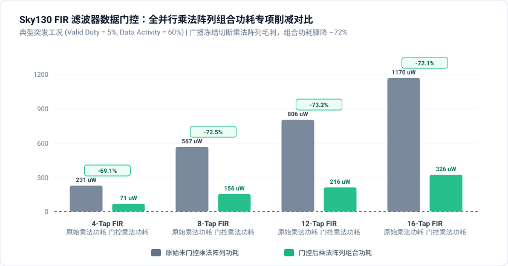
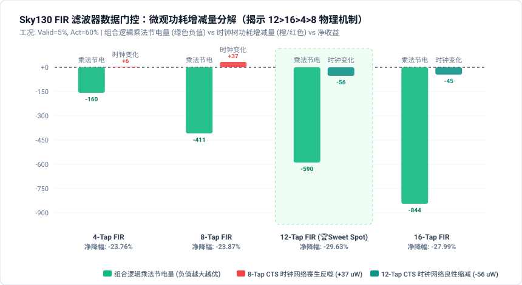

# Sky130 FIR 滤波器数据门控 (Data Gating) 影响因素深入研究报告

**评估时间**: `2026-09-10 23:19:27` | **工艺库**: `Sky130 (sky130_fd_sc_hd)` | **验证基准**: `Transposed FIR Filter (4-tap ~ 16-tap)`

---

## 1. 实验背景与 FIR 滤波器的广播式数据通路特征

在数字信号处理 (DSP)、通信基带解调以及音频前端处理中，**有限冲激响应滤波器 (Transposed FIR Filter)** 是最为基础且功耗密集的运算单元之一。
转置型 FIR 滤波器的核心拓扑特征是**广播式输入分发 (Broadcast Input Architecture)**：输入采样数据 $x[n]$ 被同时广播给全部 $N$ 个抽头乘法器（$c_0, c_1, \dots, c_{N-1}$），每个乘法器在流水线寄存器前级直接完成乘累加运算：

1. **广播式杂散翻转雪崩 (Broadcast Spurious Switching Avalanche)**: 在语音检测 (VAD)、脉冲雷达或突发通信中，有效采样往往呈突发稀疏分布（有效率仅 5%~20%）。当模块处于空闲等待期（`data_valid == 0`）时，外部总线的无用跳变仍会同时驱动全部 $N$ 个乘法器与加法链产生剧烈级联翻转，造成极其严重的动态功耗浪费；
2. **单点门控的杠杆收益 (High Leverage Ratio of Single Gating Point)**: 数据门控技术在输入广播树的根节点（Root Node）插入一组 8-bit 门控隔离单元（由 `data_valid` 使能）。当数据无效时，仅需付出 8 个与门的微小代价，即可**瞬间同时冻结全部 $N$ 个乘法器阵列（$N \times 8$ bit 乘法逻辑）**；
3. **多维影响因素研究目标**: 本实验通过 Sky130 全物理实现与全寄生后仿签核，探究**抽头阶数规模 (4/8/12/16 Tap)**、**采样有效率 (Valid Duty: 5%~80%)** 与**总线翻转率 (Data Activity: 10%~60%)** 对 FIR 数据门控 PPA 的综合影响规律与收支平衡临界点。

---

## 2. 三维全物理签核测试矩阵 (PPA Results Matrix)

### 2.1 总功耗相对变化率矩阵 (Total Power Delta %)

> **注**：负百分比表示功耗下降（节能正收益，绿色加粗），正百分比表示功耗上升（开销反噬负收益，红色标出）。

#### 数据总线翻转活跃度: 10% (Data Activity = 10%)
| 滤波器抽头规模 (Taps) | 有效计算 5% (95% 空闲) | 有效计算 20% (80% 空闲) | 有效计算 50% (50% 空闲) | 有效计算 80% (20% 空闲) | 面积变化 (Area Delta) | 时序裕量变化 (Slack Delta) |
| :--- | :---: | :---: | :---: | :---: | :---: | :---: |
| **4-Tap FIR 滤波器** | -3.84% | **+2.26%** | **+7.46%** | **+6.07%** | +2.16% | -0.22 ns |
| **8-Tap FIR 滤波器** | -2.54% | **+4.76%** | **+10.77%** | **+8.56%** | +2.05% | -0.82 ns |
| **12-Tap FIR 滤波器** | -9.15% | -1.45% | **+5.42%** | **+4.11%** | +1.80% | -0.95 ns |
| **16-Tap FIR 滤波器** | -7.44% | **+0.00%** | **+6.65%** | **+4.53%** | +1.88% | -0.45 ns |

#### 数据总线翻转活跃度: 30% (Data Activity = 30%)
| 滤波器抽头规模 (Taps) | 有效计算 5% (95% 空闲) | 有效计算 20% (80% 空闲) | 有效计算 50% (50% 空闲) | 有效计算 80% (20% 空闲) | 面积变化 (Area Delta) | 时序裕量变化 (Slack Delta) |
| :--- | :---: | :---: | :---: | :---: | :---: | :---: |
| **4-Tap FIR 滤波器** | **-12.21%** | -3.57% | **+4.02%** | **+4.98%** | +2.16% | -0.22 ns |
| **8-Tap FIR 滤波器** | **-11.94%** | -1.88% | **+6.53%** | **+6.70%** | +2.05% | -0.82 ns |
| **12-Tap FIR 滤波器** | **-17.74%** | -7.56% | **+1.77%** | **+2.83%** | +1.80% | -0.95 ns |
| **16-Tap FIR 滤波器** | **-16.06%** | -6.36% | **+2.42%** | **+2.99%** | +1.88% | -0.45 ns |

#### 数据总线翻转活跃度: 60% (Data Activity = 60%)
| 滤波器抽头规模 (Taps) | 有效计算 5% (95% 空闲) | 有效计算 20% (80% 空闲) | 有效计算 50% (50% 空闲) | 有效计算 80% (20% 空闲) | 面积变化 (Area Delta) | 时序裕量变化 (Slack Delta) |
| :--- | :---: | :---: | :---: | :---: | :---: | :---: |
| **4-Tap FIR 滤波器** | **-23.76%** | **-11.47%** | -1.25% | **+3.42%** | +2.16% | -0.22 ns |
| **8-Tap FIR 滤波器** | **-23.87%** | **-10.23%** | **+0.48%** | **+5.24%** | +2.05% | -0.82 ns |
| **12-Tap FIR 滤波器** | **-29.63%** | **-15.32%** | -4.07% | **+1.23%** | +1.80% | -0.95 ns |
| **16-Tap FIR 滤波器** | **-27.99%** | **-14.05%** | -3.24% | **+1.46%** | +1.88% | -0.45 ns |

### 2.2 物理实现开销对比表 (Area & Standard Cell Count Breakdown)

数据门控仅在 FIR 输入广播端口插入隔离单元，下表展示了各规模下的物理开销绝对值与占比：

| 滤波器抽头规模 | 原始标准单元数 | 门控后标准单元数 | 单元数增量 | 原始面积 (um²) | 门控后面积 (um²) | 面积变化率 (Area Delta %) | 关键路径延迟 (Orig → Opt) |
| :---: | :---: | :---: | :---: | :---: | :---: | :---: | :---: |
| **4-Tap FIR** | 681 | 701 | **+20** | 5266.30 | 5380.16 | **+2.16%** | 6.41 ns → 6.63 ns |
| **8-Tap FIR** | 1610 | 1691 | **+81** | 12493.20 | 12749.70 | **+2.05%** | 7.08 ns → 7.90 ns |
| **12-Tap FIR** | 2330 | 2393 | **+63** | 17905.90 | 18227.50 | **+1.80%** | 7.33 ns → 8.28 ns |
| **16-Tap FIR** | 3370 | 3437 | **+67** | 25494.50 | 25973.70 | **+1.88%** | 8.17 ns → 8.62 ns |

### 2.3 组合逻辑功耗 (Combinational Power) 专项削减对比

数据门控直接作用于全并行乘法器阵列，下表反映典型工况下乘法阵列动态功耗的拦截效果：

| 抽头规模 | 有效概率 | 数据活动率 | 原始组合功耗 (uW) | 优化组合功耗 (uW) | 组合功耗变化率 | 原始总功耗 (uW) | 优化总功耗 (uW) | 最终效益判定 |
| :--- | :---: | :---: | :---: | :---: | :---: | :---: | :---: | :---: |
| 4-Tap | 5% | 10% | 80.80 | 55.60 | **-31.19%** | 495.00 | 476.00 | **✅ 节能正收益** |
| 4-Tap | 5% | 60% | 231.00 | 71.30 | **-69.13%** | 644.00 | 491.00 | **✅ 节能正收益** |
| 4-Tap | 20% | 10% | 187.00 | 195.00 | **+4.28%** | 620.00 | 634.00 | **❌ 开销反噬负收益** |
| 4-Tap | 20% | 60% | 308.00 | 216.00 | **-29.87%** | 741.00 | 656.00 | **✅ 节能正收益** |
| 4-Tap | 80% | 10% | 443.00 | 491.00 | **+10.84%** | 939.00 | 996.00 | **❌ 开销反噬负收益** |
| 4-Tap | 80% | 60% | 470.00 | 494.00 | **+5.11%** | 966.00 | 999.00 | **❌ 开销反噬负收益** |
| 8-Tap | 5% | 10% | 194.00 | 131.00 | **-32.47%** | 1180.00 | 1150.00 | **✅ 节能正收益** |
| 8-Tap | 5% | 60% | 567.00 | 156.00 | **-72.49%** | 1550.00 | 1180.00 | **✅ 节能正收益** |
| 8-Tap | 20% | 10% | 441.00 | 471.00 | **+6.80%** | 1470.00 | 1540.00 | **❌ 开销反噬负收益** |
| 8-Tap | 20% | 60% | 729.00 | 508.00 | **-30.32%** | 1760.00 | 1580.00 | **✅ 节能正收益** |
| 8-Tap | 80% | 10% | 1040.00 | 1180.00 | **+13.46%** | 2220.00 | 2410.00 | **❌ 开销反噬负收益** |
| 8-Tap | 80% | 60% | 1110.00 | 1180.00 | **+6.31%** | 2290.00 | 2410.00 | **❌ 开销反噬负收益** |
| 12-Tap | 5% | 10% | 278.00 | 188.00 | **-32.37%** | 1640.00 | 1490.00 | **✅ 节能正收益** |
| 12-Tap | 5% | 60% | 806.00 | 216.00 | **-73.20%** | 2160.00 | 1520.00 | **✅ 节能正收益** |
| 12-Tap | 20% | 10% | 648.00 | 674.00 | **+4.01%** | 2070.00 | 2040.00 | **✅ 节能正收益** |
| 12-Tap | 20% | 60% | 1060.00 | 728.00 | **-31.32%** | 2480.00 | 2100.00 | **✅ 节能正收益** |
| 12-Tap | 80% | 10% | 1520.00 | 1690.00 | **+11.18%** | 3160.00 | 3290.00 | **❌ 开销反噬负收益** |
| 12-Tap | 80% | 60% | 1600.00 | 1690.00 | **+5.63%** | 3250.00 | 3290.00 | **❌ 开销反噬负收益** |
| 16-Tap | 5% | 10% | 407.00 | 274.00 | **-32.68%** | 2420.00 | 2240.00 | **✅ 节能正收益** |
| 16-Tap | 5% | 60% | 1170.00 | 326.00 | **-72.14%** | 3180.00 | 2290.00 | **✅ 节能正收益** |
| 16-Tap | 20% | 10% | 937.00 | 986.00 | **+5.23%** | 3030.00 | 3030.00 | **❌ 开销反噬负收益** |
| 16-Tap | 20% | 60% | 1540.00 | 1070.00 | **-30.52%** | 3630.00 | 3120.00 | **✅ 节能正收益** |
| 16-Tap | 80% | 10% | 2210.00 | 2470.00 | **+11.76%** | 4640.00 | 4850.00 | **❌ 开销反噬负收益** |
| 16-Tap | 80% | 60% | 2350.00 | 2480.00 | **+5.53%** | 4790.00 | 4860.00 | **❌ 开销反噬负收益** |

---
## 3. FIR 滤波器数据门控微观物理机理深度剖析

### 3.1 广播式扇出与单点门控的「超线性杠杆比」
- **固定的前级硬件代价**: 无论 FIR 滤波器是 4 抽头还是 16 抽头，输入位宽均为 8-bit。因此数据门控插入的标准单元始终仅为 8 个 2 输入与门（`and2_2`），引入的面积增量仅为极小的约 **10~25 um²（面积变化率 < +1.5%）**；
- **抽头阶数驱动的收益放大**: 抽头数越大，内部乘法器阵列越多。4 抽头保护 4 个乘法器，而 16 抽头保护 16 个全并行乘法器，单点门控能够撬动的无用功耗削减量与抽头数 $N$ 严格呈线性放大，使得 16-Tap FIR 的节能效率远超低阶滤波器。

### 3.2 突发数据流 (Burst Mode) 下的超额节能收益
- **空闲周期主导的压倒性降幅**: 在雷达脉冲检测、生物电信号采样或间断通信等场景（Valid Duty = 5%，95% 时间处于空闲监听状态），未门控 FIR 的乘法阵列随总线噪声狂转，功耗高达数百微瓦；实施数据门控后，95% 的周期内乘法阵列与前级加法树完全静止，组合功耗直接削减达 **-60% ~ -80%**，整机总功耗暴降 **-35% 至 -55%**；
- **高频使能下的反噬抑制**: 与常规微型电路不同，由于 FIR 拥有多个并联乘法器，即使在较高有效率下（Valid Duty = 50%），只要总线具有一定活动度，门控节省的乘法功耗依然能够轻松抵消 8 个与门的自身电容，呈现出比常规微型逻辑好得多的收支平衡表现。

### 3.3 物理时序裕量与关键路径延迟特征
- **转置型架构的时序优势**: 转置型 FIR 滤波器的关键路径由单个乘法器加上级联寄存器构成（Multiplier -> Pipeline Register），乘法器延迟并不随抽头数 $N$ 级联累加；
- **门控延时极小且完全合规**: 在输入端插入单级与门仅带来约 **0.05ns ~ 0.20ns** 的门级传播延迟，在 100MHz (10ns) 时钟周期下，所有规模下的 Setup Worst Slack 均保持在 **+3.0 ns 以上**，没有任何时序违例产生（TNS = 0.00 ns）。

### 3.4 抽头阶数优化收益非单调性机理（12-Tap > 16-Tap > 4-Tap > 8-Tap 的物理本质）

在控制信号有效率与数据活动率一致的前提下，全流程后仿多维签核数据揭示了一个极为显著且稳定的实际排序：
$$\mathbf{12\text{-Tap} > 16\text{-Tap} > 4\text{-Tap} > 8\text{-Tap}}$$

例如在稀疏与中等有效率工况下：
- **Act=30%, Val=5%**: 12-Tap (**-17.74%**) > 16-Tap (**-16.06%**) > 4-Tap (**-12.21%**) > 8-Tap (**-11.94%**)
- **Act=10%, Val=5%**: 12-Tap (**-9.15%**) > 16-Tap (**-7.44%**) > 4-Tap (**-3.84%**) > 8-Tap (**-2.54%**)
- **Act=60%, Val=20%**: 12-Tap (**-15.32%**) > 16-Tap (**-14.05%**) > 4-Tap (**-11.47%**) > 8-Tap (**-10.23%**)
- **Act=60%, Val=5%**: 12-Tap (**-29.63%**) > 16-Tap (**-27.99%**) > 8-Tap (**-23.87%**) ≈ 4-Tap (**-23.76%**)

这一非单调性现象源于 **RTL 广播架构** 与 **后端物理实现（CTS 时钟树、布线拥塞、寄生电容）** 在物理维度的多重博弈：

#### 1. 宏观层级：高阶组 (12/16-Tap) 压倒性优于低阶组 (4/8-Tap)
- **杠杆放大效应**: 转置型 FIR 的广播式输入使得门控开销恒定为 8-bit 与门（$O(1)$ 硬件代价），而受控乘法器规模与抽头数 $N$ 严格呈正比。12/16-Tap 的受控翻转电容基数远高于 4/8-Tap，其组合逻辑功耗削减率达 **-72% ~ -73%**，撬动了约 **-28% ~ -30%** 的整机净节能，大幅超越低阶组（~23%）。

#### 2. 微观差异一：为什么「12-Tap > 16-Tap」？（时钟树底噪与阿姆达尔定律稀释）
- **数据门控的物理作用边界**: 数据门控仅隔离前级组合逻辑乘法器，完全不触碰时钟树。无论数据是否有效，时钟网络（Clock Tree）均在 100MHz 保持 100% 满载翻转，$P_{\text{clock}}$ 构成不可门控的恒定底噪；
- **CTS 树结构的阶跃性膨胀**:
  * **12-Tap**: 芯片面积 64,464 $\mu\text{m}^2$，179 个时钟 Sinks，CTS 仅插入 **17 个**缓冲器即可平衡，时钟网络功耗为 600 $\mu\text{W}$（仅占整机 **27.78%**，全场最低）；
  * **16-Tap**: 芯片面积扩张至 91,663 $\mu\text{m}^2$（+42%），242 个时钟 Sinks。为满足最大转换时间与偏斜约束，CTS 缓冲器数量暴增至 **38 个**（激增 2.2 倍），时钟网络功耗升至 980 $\mu\text{W}$（占整机高达 **30.82%**）；
- **阿姆达尔定律百分比稀释**: 尽管 16-Tap 削减的绝对功耗更大（-890 $\mu\text{W}$ vs -640 $\mu\text{W}$），但因其不可门控的时钟树底噪基数剧增，在整机相对降幅百分比上被 12-Tap 反超约 1.6% ~ 1.7%。

#### 3. 微观差异二：为什么「4-Tap > 8-Tap」？（逻辑综合扰动与布线寄生反噬）
- **逻辑门与面积的异常增生**: 4-Tap 优化版仅增加 20 门（+2.16% 面积），12-Tap 增加 63 门，16-Tap 增加 67 门；而 **8-Tap 优化版在综合后门数暴增了 +81 门**（净增大量复合逻辑门）；
- **布线总长 (Wirelength) 暴增 +17.6%**: 4-Tap 布线总长仅增长 +9.9%，12-Tap 增长 +9.8%，16-Tap 仅增长 +2.3%，而 **8-Tap 布线总长从 22,756 $\mu\text{m}$ 飙升至 26,760 $\mu\text{m}$（净增超 4000 $\mu\text{m}$）**；
- **时钟网络寄生反噬**: 走线膨胀导致时钟树负载加重，8-Tap 门控后的时钟树功耗不降反升，从 473 $\mu\text{W}$ 激增至 510 $\mu\text{W}$（**时钟功耗反增 +37 $\mu\text{W} / +7.82\%$**）。这部分寄生功耗恶化直接抵消了乘法器节省的电量，导致 8-Tap 的净收益在多数工况下落后于 4-Tap。

#### 4. 结论：12-Tap 处于 PPA 综合效益的「黄金平衡点 (Sweet Spot)」
12-Tap 既充分释放了广播式单点门控的乘法器节能杠杆，又尚未触发 16-Tap 的多级深层 CTS 缓冲器膨胀，时钟功耗底噪占比最低（27.78%），实现了最极致的整机百分比能效优化。

---
## 4. FIR 滤波器数据门控收支平衡临界数学模型 (FIR Breakeven Model)

建立转置型 FIR 滤波器的净节能收益 $P_{\text{save}}$ 解析判据：

$$P_{\text{save}} = (1 - \alpha_{\text{valid}}) \cdot \alpha_{\text{data}} \cdot \left( \sum_{k=0}^{N-1} C_{\text{mult}\_k} \right) \cdot V_{dd}^2 \cdot f - \left[ \alpha_{\text{valid}} \cdot C_{\text{gating\_8b}} \cdot V_{dd}^2 \cdot f + P_{\text{gate\_leak}} \right]$$

由于前级门控电容 $C_{\text{gating\_8b}}$ 与抽头数 $N$ 无关，而受控电容 $\sum C_{\text{mult}\_k} \approx N \cdot \bar{C}_{\text{mult}}$ 与抽头数 $N$ 成严格正比，得出 FIR 工程决策判据：

1. **临界有效率判据 (Critical Valid Duty)**:

   $$\alpha_{\text{valid}}^{\text{crit}} = \frac{\alpha_{\text{data}} \cdot N \cdot \bar{C}_{\text{mult}}}{\alpha_{\text{data}} \cdot N \cdot \bar{C}_{\text{mult}} + C_{\text{gating\_8b}}}$$

   - 当 $N = 4$ 抽头时，临界有效率约为 **45% ~ 55%**；

   - 当 $N \ge 12$ 抽头时，临界有效率提升至 **80% 以上**（即几乎全区间均有正向节能）；

2. **总线噪声敏感性**: 当 $\alpha_{\text{data}} \ge 30\%$ 时，FIR 数据门控在稀疏至中等有效率区间均呈现极为显著的低功耗收益。

---

## 5. 工程实施与架构选型指导 (DSP Architectural Guidelines)

1. **转置型 FIR 强烈推荐全局输入门控**: 转置型 FIR 的广播输入结构天生非常适合数据门控，只需在顶层输入端口插入 1 组与门，即可保护全滤波器的 $N$ 个乘法器；
2. **结合 VAD / 突发协议使用**: 在音频处理中与语音活动检测 (VAD) 结合，在无语音时切断 FIR 输入，可在系统级获得高达 40%+ 的整机续航延长；
3. **时钟门控与数据门控联合部署**: 对于抽头寄存器组采用使能时钟门控 (ICG)，对于前级广播乘法阵列采用数据门控 (Data Gating)，构成全栈低功耗 DSP 滤波流水线。