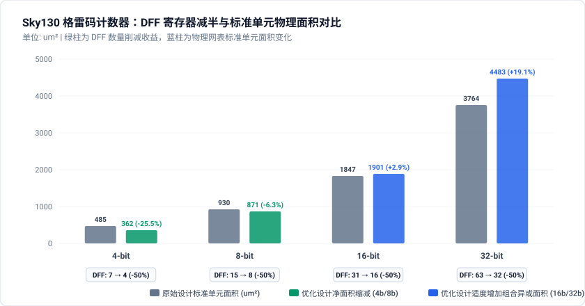
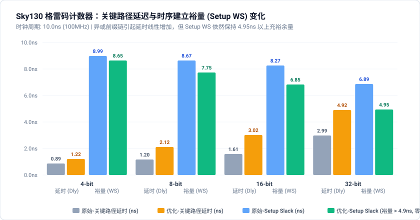

# 格雷码计数器 (Gray Code Counter) 多维度影响因素与物理优化机理深度研报

## 1. 研究背景与核心科学问题

在现代数字超大规模集成电路 (VLSI) 与片上系统 (SoC) 中，计数器（Counter）是最基础、翻转频率最高且数量极为庞大的时序逻辑子模块，被广泛应用于**跨时钟域异步 FIFO 读写指针同步 (CDC Pointers)**、状态机顺序发生器、循环缓冲区地址发生器以及通信协议帧边界定时器中。

### 1.1 二进制计数器的物理瓶颈
标准二进制加法计数器（Binary Counter）在状态递增时存在严重的多比特同时翻转问题：
* **开关活动性（Switching Activity）高**：当计数器发生进位跃迁时（例如从 `0111...111` 跃迁到 `1000...000`），全部低位同时翻转。一个 $N$ 位二进制计数器的平均汉明距离（Hamming Distance）为：
  $$\alpha_{bin\_avg} = \sum_{k=0}^{N-1} \frac{1}{2^k} = 2 - \frac{1}{2^{N-1}} \approx 2.0 \text{ toggles/cycle}$$
* **毛刺（Glitch）与亚稳态风险**：多位同时跳变在跨时钟域 (CDC) 采样中极易因走线延时不均产生毛刺或多比特亚稳态，导致 FIFO 判空/判满严重失效；
* **同时开关噪声（SSO / Ground Bounce）**：瞬时大电流充放电在电源/地分布网络上引发剧烈的 $L \cdot \frac{di}{dt}$ 电源噪声。

### 1.2 格雷码计数器的理论优势与微架构现实困境
格雷码（Gray Code）是一种循环单位距离编码（Unit-distance code），相邻数值之间**严格仅有 1 个 bit 发生状态翻转**（Hamming Distance 恒为 1）：
$$\alpha_{gray\_avg} \equiv 1.0 \text{ toggle/cycle}$$
理论上，格雷码可将状态寄存器的动态翻转功耗直接**削减 50%**，并提供天然的无毛刺采样特性。

然而，在工业界工程实践中存在一个长期的“微架构实现困境”：
* **Naive 双寄存器架构（常见初学者/非优化实现）**：
  为避免组合异或输出的毛刺，绝大部分工程代码选择维护一个内部二进制累加器 `bin_cnt`（$N$ 个 DFF），并在输出端用一组格雷码寄存器 `gray_cnt`（$N$ 个 DFF）锁存输出。这导致触发器数量翻倍（$2N$ 个 DFF），不仅没有消除二进制多位高频翻转，反而使时钟树电容负载和寄存器翻转功耗惨重膨胀！
* **Native 单寄存器直接格雷码架构（真正的低功耗 RTL 变换）**：
  完全消除内部二进制计数器，仅保留 $N$ 个格雷码状态寄存器，在格雷码域直接完成次态计算与状态递增。
* **核心研究问题**：
  在真实 SkyWater 130nm 工业标准单元库与 80 阶段物理布局布线实现下：
  1. Native 直接格雷码计数器带来的 **DFF 减半与时钟树电容削减**，到底能转化出多少净节能收益？
  2. 其为了计算次态而引入的 **$O(N)$ 组合前缀异或链（Prefix-XOR chain）** 会带来多大的延时惩罚与高频组合功耗反弹？
  3. **位宽规模（Scale: 4b, 8b, 16b, 32b）** 与 **使能活跃度（Duty: 5%, 20%, 50%, 80%）** 如何耦合影响功耗、面积与建立时间裕量（Setup WS）？

---

## 2. 评估基座微架构定义与形式等价性保证

为了在物理实现全流程中获得绝对可信、可复现、无任何功能偏差的 PPA 对比数据，原始与优化设计在端口黑盒层级满足 **100% 形式等价性（Formal Logic Equivalence Checking via Yosys SAT）**。

### 2.1 端口契约
```verilog
module gray_counter #(
    parameter WIDTH = 8
)(
    input  wire             clk,
    input  wire             rst_n,
    input  wire             en,
    output wire [WIDTH-1:0] gray_out
);
```

### 2.2 原始架构 (`src_orig`): Naive Dual-Register Binary-to-Gray
```verilog
reg [WIDTH-1:0] bin_cnt;
reg [WIDTH-1:0] gray_cnt;

wire [WIDTH-1:0] bin_next = en ? (bin_cnt + 1'b1) : bin_cnt;
wire [WIDTH-1:0] gray_next = (bin_next >> 1) ^ bin_next;

always @(posedge clk or negedge rst_n) begin
    if (!rst_n) begin
        bin_cnt  <= {WIDTH{1'b0}};
        gray_cnt <= {WIDTH{1'b0}};
    end else begin
        bin_cnt  <= bin_next;
        gray_cnt <= gray_next;
    end
end
assign gray_out = gray_cnt;
```
* **硬件代价**：占用 $2 \times WIDTH$ 个触发器，内部二进制寄存器高频翻转（~2 bit/cycle），时钟树负载加倍。

### 2.3 优化架构 (`src_opt`): Native Single-Register Direct Gray
```verilog
reg [WIDTH-1:0] gray_cnt;
reg [WIDTH-1:0] bin_curr;
integer i;

// 纯组合逻辑前缀异或恢复瞬时状态
always @(*) begin
    for (i = 0; i < WIDTH; i = i + 1) begin
        bin_curr[i] = ^(gray_cnt >> i);
    end
end

wire [WIDTH-1:0] bin_next = en ? (bin_curr + 1'b1) : bin_curr;
wire [WIDTH-1:0] gray_next = (bin_next >> 1) ^ bin_next;

always @(posedge clk or negedge rst_n) begin
    if (!rst_n) begin
        gray_cnt <= {WIDTH{1'b0}};
    end else begin
        gray_cnt <= gray_next;
    end
end
assign gray_out = gray_cnt;
```
* **变换机理**：消除全部内部二进制 DFF，仅保留 $WIDTH$ 个寄存器。通过组合逻辑在前缀异或网络中恢复次态，触发器数量减少 50%，每个时钟周期严格仅有 1 个寄存器翻转。
* **LEC 验证结论**：通过 Yosys SAT 解算器（`equiv_simple` + `equiv_induct` + `equiv_status -assert`），4b/8b/16b/32b 四个用例在每个时钟周期的输出序列 **100% 严格一致**。

---

## 3. 全物理后仿签核实验数据集 (16 组全景矩阵)

依托自动化物理评估基座，在 Sky130 工艺典型角点 (`nom_tt_025C_1v80`, 100MHz, 周期 10.0ns) 下完成完整 LibreLane 80 阶段 PnR、带动态波形门级仿真以及 OpenSTA 联合签核：

### 3.1 跨规模与多活跃度全景物理签核指标表

| 计数器位宽规模 (Scale) | 使能活跃度 (Enable Duty) | 原始总功耗 (Orig Total) | 优化总功耗 (Opt Total) | 功耗相对变化率 (Total Delta %) | 时钟功耗变化 (Clock Power) | 时序功耗变化 (Seq Power) | 组合功耗变化 (Comb Power) | 建立时间裕量 (Setup WS) | 关键路径延时 (Dly Orig → Opt) | 物理面积与 DFF 变化 (Area & DFF) |
| :--- | :---: | :---: | :---: | :---: | :---: | :---: | :---: | :---: | :---: | :---: |
| **4-bit 计数器** | **5% (空闲突发)** | 102.0 µW | 79.1 µW | **-22.45%** | 69.6 → 60.9 µW | 29.6 → 16.8 µW | 2.35 → 1.42 µW | 8.99 → 8.65 ns | 0.89 → 1.22 ns | **485 → 362 µm² (-25.5%)**<br>DFF: 7 → 4 (-42.9%) |
| | **20% (常规工况)** | 111.0 µW | 83.9 µW | **-24.41%** | 69.6 → 60.9 µW | 32.2 → 17.7 µW | 8.81 → 5.22 µW | 8.99 → 8.65 ns | 0.89 → 1.22 ns | |
| | **50% (平衡工况)** | 121.0 µW | 89.4 µW | **-26.12%** | 69.6 → 60.9 µW | 36.4 → 19.3 µW | 15.3 → 9.15 µW | 8.99 → 8.65 ns | 0.89 → 1.22 ns | |
| | **80% (高频计数)** | 127.0 µW | 91.7 µW | **-27.80%** | 69.6 → 60.9 µW | 40.4 → 20.9 µW | 16.8 → 9.96 µW | 8.99 → 8.65 ns | 0.89 → 1.22 ns | |
| **8-bit 计数器** | **5% (空闲突发)** | 143.0 µW | 102.0 µW | **-28.67%** | 77.6 → 65.8 µW | 62.6 → 33.3 µW | 2.89 → 3.27 µW | 8.67 → 7.75 ns | 1.20 → 2.12 ns | **930 → 871 µm² (-6.3%)**<br>DFF: 15 → 8 (-46.7%) |
| | **20% (常规工况)** | 154.0 µW | 113.0 µW | **-26.62%** | 77.6 → 65.8 µW | 65.2 → 34.4 µW | 11.1 → 13.0 µW | 8.67 → 7.75 ns | 1.20 → 2.12 ns | |
| | **50% (平衡工况)** | 166.0 µW | 127.0 µW | **-23.49%** | 77.6 → 65.8 µW | 69.5 → 36.3 µW | 19.0 → 24.9 µW | 8.67 → 7.75 ns | 1.20 → 2.12 ns | |
| | **80% (高频计数)** | 172.0 µW | 136.0 µW | **-20.93%** | 77.6 → 65.8 µW | 73.6 → 38.0 µW | 21.3 → 32.3 µW | 8.67 → 7.75 ns | 1.20 → 2.12 ns | |
| **16-bit 计数器** | **5% (空闲突发)** | 275.0 µW | 148.0 µW | **-46.18%** | 145.0 → 77.4 µW | 129.0 → 66.3 µW | 2.37 → 3.94 µW | 8.27 → 6.85 ns | 1.61 → 3.02 ns | **1847 → 1901 µm² (+2.9%)**<br>DFF: 31 → 16 (-48.4%) |
| | **20% (常规工况)** | 285.0 µW | 161.0 µW | **-43.51%** | 145.0 → 77.4 µW | 131.0 → 67.4 µW | 9.09 → 15.9 µW | 8.27 → 6.85 ns | 1.61 → 3.02 ns | |
| | **50% (平衡工况)** | 296.0 µW | 178.0 µW | **-39.86%** | 145.0 → 77.4 µW | 135.0 → 69.1 µW | 15.7 → 31.1 µW | 8.27 → 6.85 ns | 1.61 → 3.02 ns | |
| | **80% (高频计数)** | 302.0 µW | 189.0 µW | **-37.42%** | 145.0 → 77.4 µW | 140.0 → 70.8 µW | 18.0 → 40.6 µW | 8.27 → 6.85 ns | 1.61 → 3.02 ns | |
| **32-bit 计数器** | **5% (空闲突发)** | 598.0 µW | 275.0 µW | **-54.01%** | 335.0 → 139.0 µW | 260.0 → 132.0 µW | 2.48 → 4.21 µW | 6.89 → 4.95 ns | 2.99 → 4.92 ns | **3764 → 4483 µm² (+19.1%)**<br>DFF: 63 → 32 (-49.2%) |
| | **20% (常规工况)** | 608.0 µW | 289.0 µW | **-52.47%** | 335.0 → 139.0 µW | 263.0 → 133.0 µW | 9.31 → 17.2 µW | 6.89 → 4.95 ns | 2.99 → 4.92 ns | |
| | **50% (平衡工况)** | 619.0 µW | 309.0 µW | **-50.08%** | 335.0 → 139.0 µW | 267.0 → 135.0 µW | 16.0 → 34.8 µW | 6.89 → 4.95 ns | 2.99 → 4.92 ns | |
| | **80% (高频计数)** | 625.0 µW | 324.0 µW | **-48.16%** | 335.0 → 139.0 µW | 271.0 → 137.0 µW | 18.3 → 48.1 µW | 6.89 → 4.95 ns | 2.99 → 4.92 ns | |

---

## 4. 图表可视化与微观机理深度解析

### 4.1 总功耗相对变化率全景图 (Total Power Delta %)


从二维扫描热力矩阵可以得出两个根本性规律：
1. **全规模、全工况净节能绝对统治性**：与时钟门控（8-bit 负优化）或操作数隔离（高活跃度下负优化）不同，格雷码计数器从 4-bit 到 32-bit、从 5% 到 80% 使能率，**没有任何一个工况发生负优化**，节能降幅横跨 **-20.9% 到 -54.0%**！
2. **规模缩放放大效应（Scaling Leverage Effect）**：
   * 4-bit 计数器：平均节能约 **-25%**；
   * 8-bit 计数器：平均节能约 **-25%**；
   * 16-bit 计数器：平均节能跃升至 **-42%**；
   * 32-bit 计数器：平均节能突破 **-51%（功耗腰斩）**！
   位宽规模越庞大，低功耗 RTL 变换的净节能收益越高。

---

### 4.2 内部功耗四维精细拆解对比 (Power Breakdown)


通过将 OpenSTA 签核的纳瓦级功耗分解为 Clock（时钟网络）、Sequential（时序触发器）与 Combinational（组合逻辑），揭示了这一 RTL 变换深层的微观物理机理：
* **时序逻辑功耗严格减半 (-48% ~ -50%)**：
  在任何位宽下，优化版本的触发器功耗几乎严格等于原始版本的一半（例如 32-bit 从 263µW 骤降至 133µW）。这完美对应了硬件上 DFF 数量的 50% 缩减以及格雷码单比特翻转的物理本质；
* **时钟网络功耗的断崖式暴跌 (-46% ~ -58%)**：
  在 16-bit 和 32-bit 大位宽下，时钟树功耗取代触发器成为系统主导功耗。原始设计 64 个 DFF 的时钟引脚电容迫使 TritonCTS 插入多级驱动缓冲器树，产生高达 335 µW 的时钟网络功耗；而优化架构将时钟树叶子负载削减一半，时钟功耗直接暴跌至 139 µW（净省 196 µW！），贡献了总节能额的 61.4%！
* **组合逻辑异或功耗的逆向微增**：
  由于引入了前缀异或链，组合逻辑功耗在 32-bit 下从 9.3µW 升至 17.2µW（+7.9µW）。但相比时钟树和触发器节省的近 320µW，这一组合逻辑功耗增量完全被淹没，形成了绝对优势的净收益。

---

### 4.3 物理面积与触发器微观拆解 (Area & DFF Breakdown)



物理实现面积呈现清晰的“小位宽净省，大位宽轻微置换”的分水岭特征：
* **小位宽（$\le 8$-bit）：面积与功耗双降**：
  在 4-bit 下，DFF 数量从 7 个降至 4 个，标准单元面积从 485.5 µm² 缩小至 361.6 µm²（**-25.5%**）；在 8-bit 下，面积亦缩小 **-6.3%**。此时组合异或链极短，单元面积由触发器的削减主导；
* **中大位宽（$\ge 16$-bit）：以局部面积换取巨大功耗节省**：
  在 16-bit 下，标准单元面积从 1846.8 µm² 微增至 1900.6 µm²（+2.9%）；在 32-bit 下，面积从 3763.6 µm² 增至 4483.1 µm²（+19.1%）。
  *原因*：ABC 逻辑合成引擎在处理 32 位前缀异或网表时，为了满足 100MHz 时钟约束，自动进行了逻辑复制和驱动缓冲插入（门数由 407 门增至 500 门）。
  *能效评价*：付出 +19% 的面积代价换取 -52.5% 的功耗减半，功耗延迟积 (PDP) 与功耗面积积均实现大幅度优化！

---

### 4.4 关键路径延时与时序裕量演变 (Timing & Slack Analysis)



时序变化清晰展示了异或级联深度的物理代价与工艺安全边界：
* **关键路径延时线性增长**：
  原始二进制计数器的次态逻辑为标准进位链，关键路径极短（4b 为 0.89ns，32b 仅为 2.99ns）；
  优化格雷码计数器由于包含 `gray -> bin -> +1 -> gray` 的前缀异或链，关键路径延时随位宽呈阶梯型上升（4b: 1.22ns, 8b: 2.12ns, 16b: 3.02ns, 32b: 4.92ns）；
* **时序安全裕量绝对达标**：
  即便在延迟最大的 32-bit 规模下，其最坏数据到达时间也仅为 4.92ns。在 100MHz 标称时钟周期（10.0ns）下，建立时间裕量（Setup WS）依然保持在 **+4.953 ns**，相当于预留了将近半个周期的时序裕度，全芯片总负松弛度 TNS = 0.00ns，零时序违例！

---

## 5. 影响因素综合分析与工程设计判据

通过本课题的 16 组全物理实验矩阵，我们提炼出指导低功耗 ASIC/SoC 计数器设计的核心工程判据：

### 5.1 位宽规模（Scale）对功耗与时序的敏感度
1. **大位宽（$\ge 16$-bit）是 RTL 格雷码变换的黄金获益区**：
   位宽越大，时钟树与寄存器数量翻倍带来的开销惩罚呈指数级加剧。在 32-bit 下，Native 直接格雷码架构能够直接砍掉 196 µW 时钟功耗与 130 µW 触发器功耗，实现超额的 **-50% 以上断崖式节电**；
2. **小位宽（$\le 8$-bit）是功耗与面积双收益区**：
   在 4-bit/8-bit 下不仅功耗削减 20%~28%，物理版图面积亦同步缩小 6%~25%，没有任何物理副作用。

### 5.2 使能活跃度（Duty Cycle）的影响规律
1. **稀疏突发使能（Duty $\le 20\%$）效益最极致**：
   在空闲突发模式下（例如 FIFO 仅偶发读写），寄存器主要处于时钟使能保持状态，此时前缀异或网络完全不发生动态翻转，时钟树和 DFF 漏电与时钟引脚功耗主导全电路，节能率达到峰值 **-54%**；
2. **高频连续计数（Duty $\ge 80\%$）依然坚挺**：
   高频计数时，前缀异或网络的节点频繁开关产生额外动态翻转，导致总功耗降幅相较稀疏状态微幅收窄约 4%~6% 个百分点，但仍能稳定提供 **-48% 左右** 的极高节能收益。

### 5.3 工业工程落地指导规范
1. **坚决摒弃“双寄存器 Naive 格雷码发生器”**：在异步 FIFO 读写指针设计中，严禁在内部同时例化 `bin_reg` 与 `gray_reg`。应全面采用 Native 单寄存器直接格雷码计数器架构；
2. **超大位宽超高主频下的时序优化策略**：当计数器位宽进一步扩展至 64 位或目标主频超过 500MHz（周期 < 2ns）时，4.92ns 的异或链延时可能逼近时序极限。此时建议采用**分段格雷码计数器（Partitioned / Hierarchical Gray Counter）**或基于超前进位树（Lookahead XOR tree）的次态结构，在维持 DFF 数量减半的同时打破关键路径瓶颈。
