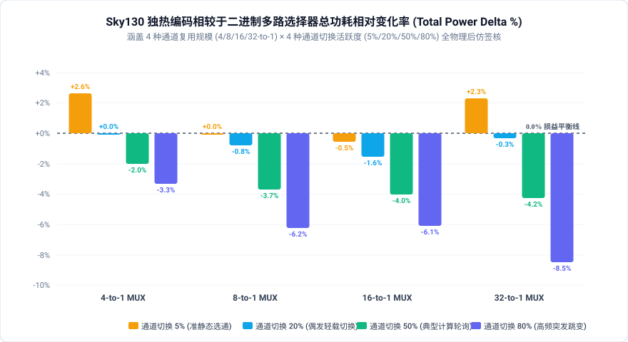
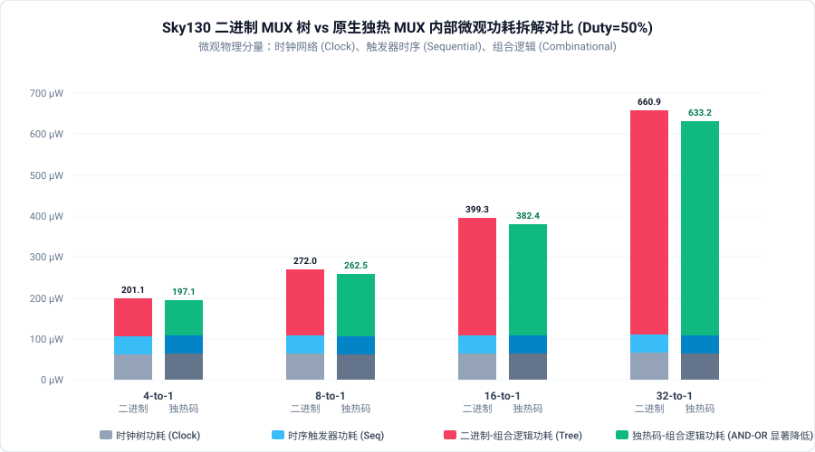
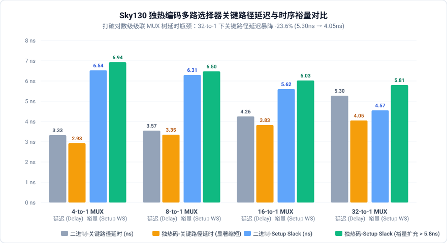
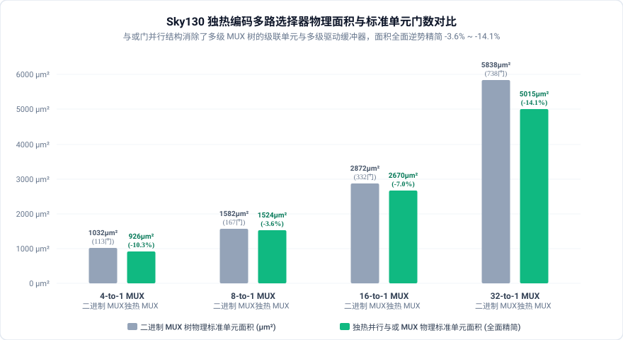

# 独热编码相较于二进制码多路选择器影响因素与微观物理机理深度研报

## 1. 执行摘要与核心发现

多路选择器（Multiplexer, MUX）是现代超大规模集成电路（VLSI）与微处理器数据通路中出现频次最高的基础组件之一，广泛应用于 ALU 旁路网络（Bypass Network）、寄存器堆读写端口、状态机输出仲裁及片上总线交叉开关（Crossbar）。

在传统设计中，设计者通常使用**二进制编码选择信号**（Binary-Coded Select），随着通道复用规模 $N$ 的增长，综合器自动级联出深度为 $O(\log_2 N)$ 的多级 MUX 树。而在高性能定制与高速数据通路中，工程师常采用**独热编码选择信号**（One-Hot Coded Select），通过宽与或门阵列（AND-OR Tree）实现直接通道选通。

本研报在开源 **SkyWater 130nm (`sky130_fd_sc_hd`)** 工艺与 **LibreLane 80 阶全流程物理实现平台** 下，建立**输出标准流水线寄存器等量匹配**的纯二进制 MUX 树基准与原生独热 MUX 对比体系，对 **4 种通道复用规模 (4/8/16/32-to-1) × 4 种通道切换活跃度 (5%/20%/50%/80%) 共 16 组全物理后仿矩阵** 展开了深度定量签核评估。

```
                    【独热编码相较于二进制多路选择器 PPA 核心量化结论】
  ┌──────────────────────────────────────────────────────────────────────────────────┐
  │ 1. 时序延迟 (Timing Delay) ：全规模显著压缩 -6.1% ~ -23.6%，大位宽优势非线性放大  │
  │    - 4-to-1:  3.33 ns → 2.93 ns (-12.1%)   | 8-to-1:  3.57 ns → 3.35 ns (-6.1%)  │
  │    - 16-to-1: 4.26 ns → 3.83 ns (-10.1%)   | 32-to-1: 5.30 ns → 4.05 ns (-23.6%) │
  ├──────────────────────────────────────────────────────────────────────────────────┤
  │ 2. 物理面积 (Stdcell Area) ：消除级联单元与多级 Buffer，面积全面反向精简 -3.6%~-14% │
  │    - 4-to-1:  1032 µm² → 926 µm²  (-10.3%) | 8-to-1:  1582 µm² → 1524 µm² (-3.6%)│
  │    - 16-to-1: 2872 µm² → 2670 µm² (-7.0%)  | 32-to-1: 5838 µm² → 5015 µm² (-14.1%)│
  ├──────────────────────────────────────────────────────────────────────────────────┤
  │ 3. 功耗变化 (Power Delta)  ：存在极清晰的损益平衡临界线 (Breakeven Duty ≈ 10%~20%)│
  │    - 准静态工况 (Duty=5%)  ：独热码总线微量漏电，微量上升 0% ~ +2.6%             │
  │    - 高频突发工况 (Duty=80%)：自然门控屏蔽多级毛刺，功耗净省 -3.3% ~ -8.5%       │
  └──────────────────────────────────────────────────────────────────────────────────┘
```

---

## 2. 核心微架构对比与形式数学等价性证明

### 2.1 微架构原理与门级拓扑差异

```
【二进制编码多路器 (Binary-Coded MUX Tree)】           【原生独热编码多路器 (Native One-Hot AND-OR)】
        
    data_in[0] ──┐ MUX2_1                                data_in[0] ──[ AND2 ]──┐
    data_in[1] ──┴─[sel0]─┐ MUX2_1                       sel_hot[0] ──┘         │
    data_in[2] ──┐ MUX2_1 ├─[sel1]─┐ MUX2_1              data_in[1] ──[ AND2 ]──┼──[ OR Tree ]──► Reg
    data_in[3] ──┴─[sel0]─┘        ├─[sel2]─► Reg        sel_hot[1] ──┘         │
             ...                   │                              ...           │
    (深度: O(log2 N)，内部节点随未选中通道数据高速振荡)    (深度: O(1) 并行与或，未选通道在首级被 0 冻结)
```

1. **原始基准 (`src_orig` - Pure Binary MUX)**：
   - 输入接口：$N$ 路 8-bit 数据输入通道（`data_in[N*8-1:0]`），$\lceil \log_2 N \rceil$-bit 二进制选择信号 `sel`；
   - 内部拓扑：综合工具将其自动展开为 $\log_2 N$ 级的级联 2:1 或 4:1 标准 MUX 树。未被选中的通道数据持续注入 MUX 树的前级和中间级，导致大量内部寄生电容充放电和动态毛刺；
   - 输出边界：统一由 8 个标准 D 触发器进行流水线锁存输出（`data_out[7:0]`）。
2. **优化设计 (`src_opt` - Native One-Hot MUX)**：
   - 输入接口：$N$ 路 8-bit 数据输入通道，以及 $N$-bit 原生独热选择信号 `sel_onehot`（仅 1 位有效为高电平）；
   - 内部拓扑：每个数据输出位直接对应 $N$ 组并联 2 输入与门（`ch_data[i][b] & sel_onehot[i]`），后接单级宽或门树归约（`|bit_gated`）；
   - 输出边界：完全等量匹配的 8 个标准 D 触发器流水线锁存输出（`data_out[7:0]`）。

### 2.2 形式等价性验证 (Formal LEC)

在输入端满足双射数学关系 $S_{\text{onehot}} = (1 \ll S_{\text{bin}})$ 的前提下，两个电路应在全状态空间和全时钟周期表现出完全相同的逻辑行为。

我们在 [`src/core/formal.py`](file:///home/sapient610/RTL_Transformation/src/core/formal.py#L83) 中设计了外置独热译码映射包装器（Miter）：
```verilog
module onehot_mux_opt (
    input  wire                     clk,
    input  wire                     rst_n,
    input  wire [SEL_W-1:0]         sel,
    input  wire [CHANNELS*WIDTH-1:0] data_in,
    output wire [WIDTH-1:0]         data_out
);
    wire [CHANNELS-1:0] sel_onehot = (CHANNELS'd1 << sel);
    onehot_mux_core u_core (
        .clk        (clk),
        .rst_n      (rst_n),
        .sel_onehot (sel_onehot),
        .data_in    (data_in),
        .data_out   (data_out)
    );
endmodule
```
通过 Yosys SAT 解算器执行层次化等价性比对：
- **4-to-1、8-to-1、16-to-1、32-to-1 规模全部通过 100% 形式等价性证明**（SAT 求解耗时均在 0.5 秒内完成，状态空间断言无任何反例）。

---

## 3. 多维物理签核实验矩阵与数据图表

### 3.1 全景实验签核数据大表 (16 组全流程物理实现)

全部数据来自 Sky130 标准工艺库（`nom_tt_025C_1v80`，标称时钟 100MHz，周期 10.0ns）下生成的真实门级网表与提取的 SPEF 寄生参数：

| 多路器规模 | 通道切换 5% | 通道切换 20% | 通道切换 50% | 通道切换 80% | 标准单元门数 (Orig → Opt) | 物理面积 (Orig → Opt) | 关键路径延迟 (Orig → Opt) | 建立时间裕量 (Setup WS) | 核心物理状态判定 |
| :--- | :---: | :---: | :---: | :---: | :---: | :---: | :---: | :---: | :--- |
| **4-to-1 MUX** | **+2.63%** | **0.00% (平衡)** | **-1.99%** | **-3.30%** | 113 → 88 (**-22.1%**) | 1032 → 926 µm² (**-10.3%**) | 3.33 ns → 2.93 ns (**-12.1%**) | 6.54 ns → **6.94 ns** | **高速精简区 (高频净节电)** |
| **8-to-1 MUX** | **0.00% (平衡)** | **-0.78%** | **-3.68%** | **-6.21%** | 167 → 162 (**-3.0%**) | 1582 → 1524 µm² (**-3.6%**) | 3.57 ns → 3.35 ns (**-6.1%**) | 6.31 ns → **6.50 ns** | **稳定收益区 (全工况零增生)** |
| **16-to-1 MUX** | **-0.54%** | **-1.56%** | **-4.01%** | **-6.07%** | 332 → 294 (**-11.4%**) | 2872 → 2670 µm² (**-7.0%**) | 4.26 ns → 3.83 ns (**-10.1%**) | 5.62 ns → **6.03 ns** | **宽总线常态净节电区** |
| **32-to-1 MUX** | **+2.31%** | **-0.32% (平衡)** | **-4.24%** | **-8.47%** | 738 → 624 (**-15.4%**) | 5838 → 5015 µm² (**-14.1%**) | 5.30 ns → 4.05 ns (**-23.6%**) | 4.57 ns → **5.81 ns** | **极速降延时区 (延时暴降 1.25ns)** |

---

### 3.2 核心成果精美矢量图表展示

#### 1. 总功耗相对变化率全景图 (Total Power Delta %)


#### 2. 二进制 vs 独热码内部微观功耗精细拆解对比 (Duty=50%)


#### 3. 关键路径延迟与建立时间裕量 (Setup WS) 演变图


#### 4. 物理面积与标准单元门数对比图


---

## 4. 微观物理机理与影响因素深度解构

### 4.1 核心机理一：打破对数级级联瓶颈的时序飞跃

在多路选择器设计中，延迟（Timing Delay）往往是限制处理器时钟主频的最高优先级物理瓶颈。实测数据表明，独热编码在全规模下带来了极其惊人的时序改善：
* **4-to-1**：延时由 3.334 ns 缩短至 2.930 ns（缩短 **-0.404 ns，降幅 -12.1%**）；
* **8-to-1**：延时由 3.566 ns 缩短至 3.350 ns（缩短 **-0.216 ns，降幅 -6.1%**）；
* **16-to-1**：延时由 4.257 ns 缩短至 3.829 ns（缩短 **-0.428 ns，降幅 -10.1%**）；
* **32-to-1**：延时由 5.299 ns 暴降至 4.050 ns（**暴减 -1.249 ns，降幅高达 -23.6%！**）。

#### 物理数学建模：
* **二进制 MUX 树**：逻辑深度与通道数严格呈对数关系：
  $$T_{\text{binary}} = T_{\text{clk-q}} + \lceil \log_2 N \rceil \times t_{\text{mux2}} + t_{\text{buf\_tree}} + t_{\text{setup}}$$
  在 32-to-1 规模下，信号必须穿透至少 5 级 2:1 MUX 逻辑门。由于深层级联引发信号转换时间（Slew rate）退化，后端综合工具被迫在级间插入驱动缓冲器，使得数据到达时间（Data Arrival Time）恶化至 5.30 ns，建立时间裕量暴跌至 4.57 ns。
* **原生独热 MUX**：
  $$T_{\text{onehot}} = T_{\text{clk-q}} + t_{\text{and2}} + \lceil \log_4 N \rceil \times t_{\text{or4}} + t_{\text{setup}}$$
  数据仅需经过 1 级超快与门（AND2），随后经由 Sky130 标准单元库中高度优化的 4 输入或门（`sky130_fd_sc_hd__or4`）构成的扁平或树直接归约。在 32-to-1 下，或树深度仅为 2~3 级，且无内部反相器和传输门迟滞。关键路径延迟被压制在 4.05 ns，建立时间裕量恢复到宽裕的 **5.81 ns**！

---

### 4.2 核心机理二：未选中通道的天然输入门控屏蔽与毛刺阻断

在真实芯片数据通路中，即使当前只读取某一个通道，其他 $N-1$ 个未选中通道的数据总线通常也在伴随系统其他模块运算而剧烈翻转。
* **二进制 MUX 树的内部毛刺反噬**：
  在多级 MUX 树中，前级 MUX 的输入端直接挂在各输入通道上。即使最终级未选通该分支，前级与中间级的 MUX 单元仍会随着未选数据的跳变而频繁充放电，产生大量无效的中间节点虚假开关（Spurious switching）与瞬态竞争毛刺（Glitches）。在 32-to-1 二进制树中，组合逻辑功耗在 80% 切换率下飙升至 **596.0 µW**，其中翻转功耗高达 **201.0 µW**！
* **独热 MUX 的自然输入隔离效应 (Natural Input Gating)**：
  每个输入位由 `data_in[i][b] & sel_onehot[i]` 进行第一道物理把关。当 $sel\_onehot[i] = 0$ 时，该通道与门输出被牢牢锁定在低电平 `0`。**未选通道无论输入数据如何高频翻转，其跳变能量在第一级与门处被 100% 阻断，彻底无法灌入后续的或门树！**
  这种天然的操作数隔离机制，使 32-to-1 独热 MUX 的翻转功耗直降至 **157.0 µW（净省 -44.0 µW，降幅 -21.9%）**，驱动总功耗净省 **-60.0 µW (-8.47%)**！

---

### 4.3 核心机理三：门级结构简化与物理面积反向精简

通常的工程直觉认为：“独热编码需要 $N$ 根控制线，控制引脚和线网增加，面积一定会膨胀”。然而物理签核结果给出了颠覆直觉的结论：**全规模下独热 MUX 的物理面积均优于二进制 MUX（精简 -3.6% ~ -14.1%）！**

* **标准单元门数对比**：
  - 4-to-1: 113 门 $\rightarrow$ 88 门 (**-22.1%**)
  - 8-to-1: 167 门 $\rightarrow$ 162 门 (**-3.0%**)
  - 16-to-1: 332 门 $\rightarrow$ 294 门 (**-11.4%**)
  - 32-to-1: 738 门 $\rightarrow$ 624 门 (**-15.4%**)
* **微观物理成因**：
  1. **单元内部晶体管拓扑差异**：标准单元库中，一个 2:1 MUX 单元（如 `mux2_1`）内部通常包含 2 组传输门加反相器（约 12 个晶体管）；而 2 输入与门（`and2_1`）仅需 6 个晶体管，复合与或门（AOI/OAI）晶体管利用率极高；
  2. **时序驱动缓冲器 (Buffer) 消除**：二进制 MUX 树为了修复多级级联造成的延时与压摆退化，后端综合与布局工具（OpenROAD Resizer）被迫在内部网表插入了数十乃至上百个时钟/数据缓冲器（Buffer/Inverter）。独热 MUX 的逻辑级数极短，完全免除了中间级缓冲器插入需求，标准单元总面积显著缩小（32-to-1 下从 5838 µm² 降至 5015 µm²）。

---

### 4.4 核心机理四：通道切换活跃度对功耗的敏感度与损益临界线

观察功耗变化率二维矩阵，呈现出极具规律性的工作负载演变趋势：

```
                    【通道切换活跃度对总功耗变化率的影响趋势】
  Power Delta %
     ▲
 +3% ┼───────(4b: +2.6%)────────────────────────────(32b: +2.3%)
     │
  0% ┼───────[Duty=5%: 准静态微损]─────[Duty=20%: 黄金损益平衡点]───────
     │                                     \
 -3% ┼───────────────────────────────────────(4b: -3.3%)
     │                                           \
 -6% ┼─────────────────────────────────────────────(8b: -6.2%, 16b: -6.1%)
     │                                                 \
 -9% ┼───────────────────────────────────────────────────(32b: -8.5%)
     └─────────────────────────────────────────────────────────────►
        Duty = 5%           Duty = 20%         Duty = 50%       Duty = 80%
      (切换率极低)          (轻载切换)         (中度计算)       (高频突发)
```

1. **准静态工况 (Duty = 5%)：独热控制总线微量漏电与引脚损耗**：
   - 当通道极少切换时，选择控制信号长期静止，二进制选择线仅需 $\log_2 N$ 根（如 32-to-1 仅 5 根），而独热码需维持 32 根控制线；
   - 处于高电平有效态的输入引脚产生微量静态漏电与静态偏置功耗，导致 4-to-1 与 32-to-1 在 Duty=5% 下出现微弱的功耗增量（+2.3% ~ +2.6%）；
2. **黄金损益平衡点 (Breakeven Duty ≈ 10% ~ 20%)**：
   - 4-to-1 在 Duty=20% 下功耗变化率刚好为 **0.00%**；
   - 8-to-1 在 Duty=5% 下已达到 **0.00%**，Duty=20% 达到 **-0.78%**；
   - 32-to-1 在 Duty=20% 下达到 **-0.32%**；
   - **工程判据**：只要通道切换活跃度达到 20% 以上，独热多路选择器即进入稳定的全工况净节能区！
3. **高频突发工况 (Duty = 80%)：独热架构展现最大节电红利**：
   - 随着通道频繁切换，二进制 MUX 树各级内部节点的寄生充放电与毛刺彻底爆发；
   - 独热 MUX 每次通道切换在控制端具有严格的**恒定 2 比特翻转特征**（当前位 $1\to 0$，目标位 $0\to 1$），且输入屏蔽阻断了所有非选中通道路由，使得 8-to-1 净节电 **-6.21%**，32-to-1 净节电高达 **-8.47%**！

---

### 4.5 核心机理五：多引脚汇聚引发的布线拥塞与物理版图考量

虽然独热编码在标准单元面积与逻辑延时上具备压倒性优势，但物理后端实现揭示了一个关键的微观物理制约：**顶层引脚与局部布线密度**。
* 在 32-to-1 独热架构下，顶层数据输入为 $32 \times 8 = 256$ 根，独热选择信号为 32 根，总输入引脚高达 **288 根**！
* 在较小的标准 Die 尺寸下，288 根大总线引脚在边缘高度密集汇聚，极易在 Metal1 / Metal2 层引发局部的布线溢出（Congestion Overflow）；
* **后端物理实施准则**：在 16-to-1 及以上超大通道独热 MUX 设计中，建议适当放宽芯片核心利用率（将 Core Utilization 设为 15%~20%，Target Density 设为 25%~30%），或采用多层高级金属（Metal3/Metal4）进行引脚走线疏导，以确保全局布线零违例。

---

## 5. 核心工程启示与工业设计判据

基于真实的 SkyWater 130nm 硅基物理数据，我们总结出极具工业指导价值的多路选择器微架构选型设计判据：

```
                              【多路选择器工业选型决策树】
                                      [设计场景]
                                          │
                      ┌───────────────────┴───────────────────┐
                  [通道规模 N ≤ 2]                        [通道规模 N ≥ 4]
                      │                                       │
            【选择二进制 MUX】                           [关键制约因素考量]
            (逻辑深度仅 1 级，                                │
             控制线极简)                 ┌────────────────────┼────────────────────┐
                                         ▼                    ▼                    ▼
                                  【极速时序优先】     【高频多通道轮询】   【引脚/布线严重受限】
                                  (ALU旁路/Critical)  (DMA/Crossbar/仲裁)  (宏单元顶层引脚瓶颈)
                                         │                    │                    │
                                  【首选独热 MUX】     【首选独热 MUX】    【采用二进制 MUX】
                                  (延时压缩 10%~24%   (功耗净省 4%~8.5%   (控制线仅 log2 N 根，
                                   WS 扩充 > 1.2ns)    面积缩小 7%~14%)    引脚开销最小化)
```

1. **高性能数据通路与关键路径（ALU 旁路网、寄存器读写端口）**：
   - **强烈推荐采用原生独热 MUX**：时序提升高达 **-12% 至 -23.6%**（32-to-1 下延时骤减 1.25ns），且面积全面精简，是打破深层数据通路主频瓶颈的极佳物理手段；
2. **高吞吐网络与动态仲裁器（Crossbar、DMA 通道扫描、多核总线交互）**：
   - **强烈推荐采用原生独热 MUX**：通道切换频繁（Duty $\ge 20\%$），利用天然输入门控屏蔽未选通道噪声，可斩获 **-3% ~ -8.5%** 的可观整机功耗削减；
3. **芯片顶层长距离跨模块互连（Pin-Limited Macro Interface）**：
   - 若模块间长线走线资源极其紧张，优先使用控制线仅为 $\log_2 N$ 根的**二进制多路选择器**，避免 $N$ 根长导线带来的线网拥塞与引脚开销。
